```{css, echo = FALSE}

table {
  caption-side: top;
}

caption {
  text-align: left;
}

.cell-output-display div:first-child:has(table.kibble) {
  padding: 0 10px !important;
  border: 1px solid #dee2e6 !important;
  border-radius: 10px;
}

table.kibble {
  margin-bottom: 1em;
  margin-top: 0;
  border-top: none;
  border-collapse: separate;
  border-spacing: 0;
}

table.kibble td {
  font-size: 0.95rem;
}

table.kibble tbody td {
  padding: 0.3rem 0.5rem;
}

table.two-head thead tr th {
  empty-cells: show !important;
}

table.two-head thead tr:first-child th {
  position: sticky;
  top: 0;
  background-color: white;
  padding-left: 15px !important;
}

table.two-head thead tr:nth-child(2) th {
  top: 40px !important;
  background-color: white !important;
}

```

## Introduction

**Goal:** look for general trends in the data.

**Data:** archaeological survey data collected by Don Schiffler in the Rio
Puerco region just west of the Jemez Mountains in New Mexico.

**Method:** standard methods for analyzing archaeological survey data from the
US Southwest, notably seriation.

**Questions:** here's a list of questions we answer with this EDA.

::: {#question-toc}
:::

## R Preamble

```{r}

library(broom)
library(ca)
library(colorspace)
library(ggeffects)
library(ggfx)
library(ggnewscale)
library(ggrepel)
library(ggspatial)
library(ggtext)
library(here)
library(kableExtra)
library(magick)
library(MASS)
library(patchwork)
library(performance)
library(sf)
library(slider)
library(terra)
library(tidyterra)
library(tidyverse)

```

Set seed

```{r}

set.seed(1701) # USS Enterprise NCC-1701

```

Some ggplot defaults

```{r}
#| code-fold: true

# region key
region_colors <- c(
  "es" = "#ED7D3A",
  "jch" = "#75485E",
  "mp" = "#9DBF9E",
  "rp" = "#006BA6"
)

region_labels <- c(
  "es" = "Elk Springs",
  "jch" = "Jones Canyon",
  "mp" = "Mesa Portales",
  "rp" = "Rio Puerco"
)

# phase key
phase_colors <- c(
  "Early PII" = "#E63946",
  "Late PII" = "#F9C846",
  "Early PIII" = "#157A6E",
  "Middle PIII" = "#C0FDFB",
  "Late PIII" = "#735CDD"
)

# a clunky function to assign colors to table cells
heat <- function(x, r = c(0, 1)) {
  colors <- sequential_hcl(256, "YlOrBr", rev = TRUE)
  i <- scales::rescale(c(x, r), c(1, 256)) |> round()
  i <- i[1:length(x)]
  colors[i]
}

# ggplot2 stuff
pretty_labels <- as_labeller(c(
  "ratio" = "Ratio of Decorated to Undecorated Ceramics",
  "relative_rate" = "Relative Rate of Decorated Ceramics"
))

squished_labels <- as_labeller(c(
  "ratio" = "Ratio of Decorated\nto Undecorated Ceramics",
  "relative_rate" = "Relative Rate of\nDecorated Ceramics"
))

theme_set(theme_bw(12))

theme_update(
  axis.text = element_text(size = rel(0.75), color = "gray50"),
  axis.ticks = element_line(linewidth = 0.2, color = "gray85"),
  axis.title = element_text(size = rel(1)),
  legend.text = element_text(size = rel(0.9)),
  legend.title = element_text(size = rel(0.9)),
  panel.grid = element_blank(),
  plot.title = element_text(size = rel(1), margin = margin(b = 2)),
  strip.background = element_blank(),
  strip.text = element_text(size = rel(1))
)

# trim all white space around image,
# but then add a few white pixels back (dx, dy)
# all done with the magic of {magick}
prepare_image <- function(x, dx = 2, dy = 30, color = "white") {
  img <- image_read(path = x)

  img <- image_trim(img)

  info <- image_info(img)

  new_width <- info[["width"]] + dx
  new_height <- info[["height"]] + dy

  img <- image_extent(
    img,
    geometry_area(new_width, new_height),
    color = color
  )

  image_write(img, path = x)
}

```

## Data

```{r}

gpkg <- here("data", "rio-puerco.gpkg")

survey_area <- read_sf(gpkg, "survey")

sites <- read_sf(
  gpkg,
  query = paste(
    "SELECT site_id, region, fnum, burn,",
    "marea AS mound_area,",
    "ifnull(karea, 0) AS kiva_area,",
    "ca AS orientation,",
    "geom AS geometry",
    "FROM sites"
  )
)

ceramics <- read_sf(
  gpkg,
  query = paste(
    "SELECT ceramics.*, sites.site_id, sites.region, 'ceramic-key'.*",
    "FROM ceramics",
    "LEFT JOIN sites",
    "ON ceramics.site_id = sites.site_id",
    "LEFT JOIN 'ceramic-key'",
    "ON ceramics.key = 'ceramic-key'.key",
    "WHERE ceramics.key NOT IN ('gpc', 'dg')"
  )
)

lithics <- read_sf(gpkg, "lithics")

rio_puerco <- read_sf(gpkg, "rio puerco")

# important places in the region (chaco, santa fe, albuquerque)
# useful for orientation in overview map
places <- read_sf(gpkg, "places")

elevation <- here("data", "elevation.tif") |> rast()

climate <- read_sf(gpkg, "climate")

```

Save attribute data without spatial locations.

```{r}

sites |>
  st_drop_geometry() |>
  write_csv(here("data", "rp-sites.csv"))

ceramics |> write_csv(here("data", "rp-ceramics.csv"))

lithics |> write_csv(here("data", "rp-lithics.csv"))

```

```{r}
#| code-fold: true

# labels -----------------------------------------------------------------------

survey_area <- survey_area |>
  mutate(name = "Rio Puerco\nSurvey Area") |>
  select(name)

lbls <- places |>
  bind_rows(survey_area) |>
  mutate(
    xmin = map_dbl(geom, \(x){
      st_bbox(x)[["xmin"]]
    }),
    xmax = map_dbl(geom, \(x){
      st_bbox(x)[["xmax"]]
    }),
    ymin = map_dbl(geom, \(x){
      st_bbox(x)[["ymin"]]
    }),
    ymax = map_dbl(geom, \(x){
      st_bbox(x)[["ymax"]]
    }),
    x = case_when(
      name == "Chaco Canyon" ~ xmin + 7500,
      name == "Rio Puerco\nSurvey Area" ~ xmax + 3500,
      name == "Santa Fe" ~ xmin + 6000,
      name == "Albuquerque" ~ xmin - 2500,
      TRUE ~ 0
    ),
    y = case_when(
      name == "Chaco Canyon" ~ ymax - 14500,
      name == "Rio Puerco\nSurvey Area" ~ ymax - 2000,
      name == "Santa Fe" ~ ymax - 5000,
      name == "Albuquerque" ~ ymax - 5000,
      TRUE ~ 0
    ),
    hjust = ifelse(name %in% c("Santa Fe", "Albuquerque"), 1, 0)
  ) |>
  st_drop_geometry() |>
  select(name, x, y, hjust)

# basemap for region -----------------------------------------------------------

get_basemap <- function(
    x,
    map = "physical",
    size = c(16000, 9000),
    dpi = 300,
    imageSR = 4326,
    path) {
  x <- st_bbox(x)

  old_ratio <- (x[["xmax"]] - x[["xmin"]]) / (x[["ymax"]] - x[["ymin"]])
  new_ratio <- (size[[1]] / size[[2]])

  if (!all.equal(old_ratio, new_ratio)) {
    msg <- paste0(
      "Extent of image (size) differs from extent of x (bbox). ",
      "Map may be warped."
    )

    warning(msg, call. = FALSE)
  }

  req <- httr2::request("http://services.arcgisonline.com/arcgis/rest/services")

  req <- httr2::req_url_path_append(req, map, "MapServer", "export")

  req <- httr2::req_url_query(
    req,
    bbox = paste(x, collapse = ","),
    bboxSR = st_crs(x)$epsg,
    imageSR = imageSR,
    format = "png",
    dpi = dpi,
    size = paste(size, collapse = ","),
    pixelType = "U8",
    noDataInterpretation = "esriNoDataMatchAny",
    interpolation = "+RSP_BilinearInterpolation",
    f = "image"
  )

  resp <- httr2::req_perform(req, path = path)

  png::readPNG(path, native = TRUE)
}

bb8 <- places |>
  st_buffer(9000) |>
  st_bbox()

dy <- bb8[["ymax"]] - bb8[["ymin"]]
dx <- bb8[["xmax"]] - bb8[["xmin"]]

fn <- here("figures", "basemap.png")

if (file.exists(fn)) {
  basemap <- png::readPNG(fn)
} else {
  basemap <- get_basemap(
    bb8,
    map = "World_Imagery",
    size = c(6000, 6000 * (dy / dx)),
    dpi = 600,
    imageSR = 26913,
    path = fn
  )
}

# regional map -----------------------------------------------------------------

gg_region <- ggplot() +
  annotation_raster(
    basemap,
    bb8[["xmin"]], bb8[["xmax"]],
    bb8[["ymin"]], bb8[["ymax"]]
  ) +
  geom_sf(
    data = st_as_sfc(bb8),
    fill = "transparent",
    color = "black"
  ) +
  geom_sf(
    data = places,
    fill = alpha("white", 0.85),
    color = "gray30",
    linewidth = 0.3
  ) +
  with_outer_glow(
    geom_sf(
      data = survey_area,
      fill = alpha("#006BA6", 0.5),
      color = "#006BA6",
      linewidth = 0.3
    ),
    colour = "white",
    expand = 1,
    sigma = 2
  ) +
  with_outer_glow(
    geom_text(
      data = lbls,
      aes(x, y, label = name),
      size = 12 / .pt,
      color = "white",
      fontface = "bold",
      hjust = lbls[["hjust"]],
      vjust = 1,
      lineheight = 0.9
    ),
    colour = "black",
    expand = 2,
    sigma = 1
  ) +
  coord_sf(
    crs = 26913,
    datum = 26913,
    expand = FALSE,
    xlim = bb8[c("xmin", "xmax")],
    ylim = bb8[c("ymin", "ymax")]
  ) +
  theme_void() +
  theme(
    legend.position = "none",
    plot.margin = margin(l = 3)
  )

# local map --------------------------------------------------------------------

bb8 <- survey_area |>
  st_buffer(1000) |>
  st_bbox()

dx <- bb8[["xmax"]] - bb8[["xmin"]]
dy <- bb8[["ymax"]] - bb8[["ymin"]]

cover <- st_sym_difference(survey_area, st_as_sfc(bb8))

lbls <- tibble(
  x = st_bbox(survey_area)[["xmax"]] - 500,
  y = st_bbox(survey_area)[["ymin"]] + seq(2000, 5800, length = 4),
  region = rev(names(region_labels))
)

gg_local <- ggplot() +
  geom_spatraster_contour_filled(
    data = elevation,
    bins = 10,
    color = "gray30",
    linewidth = 0.1
  ) +
  scale_fill_cross_blended_d(
    palette = "arid",
    alpha = 0.7,
    guide = "none"
  ) +
  ggnewscale::new_scale_fill() +
  geom_sf(
    data = survey_area,
    fill = "transparent",
    color = "black"
  ) +
  geom_sf(
    data = cover,
    fill = alpha("white", 0.7),
    color = "transparent"
  ) +
  geom_sf(
    data = rio_puerco |> st_intersection(survey_area),
    color = "#7A96C2",
    linewidth = 0.5
  ) +
  with_outer_glow(
    geom_sf(
      data = sites,
      aes(fill = region),
      size = 2,
      shape = 21,
      color = "black",
      stroke = 0.2
    ),
    colour = "white",
    expand = 3.5,
    sigma = 2
  ) +
  scale_fill_manual(
    name = NULL,
    values = region_colors
  ) +
  geom_sf(
    data = st_as_sfc(bb8),
    fill = "transparent",
    color = "black"
  ) +
  geom_point(
    data = lbls,
    aes(x, y, fill = region),
    size = 2,
    shape = 21,
    color = "black",
    stroke = 0.2
  ) +
  geom_text(
    data = lbls,
    aes(x, y, label = region_labels[region], color = region),
    size = 9 / .pt,
    hjust = 1,
    vjust = 0.4,
    nudge_x = -500
  ) +
  scale_color_manual(
    name = NULL,
    values = darken(region_colors, 0.2)
  ) +
  annotate(
    "text",
    x = st_bbox(survey_area)[["xmin"]],
    y = st_bbox(survey_area)[["ymax"]],
    label = "Rio Puerco\nProject",
    size = 11 / .pt,
    hjust = 0,
    vjust = 1,
    fontface = "bold",
    lineheight = 0.85
  ) +
  annotation_scale(
    aes(location = "br", width_hint = 0.17),
    text_cex = 0.7,
    pad_x = unit(0.35, "cm"),
    pad_y = unit(0.37, "cm")
  ) +
  coord_sf(
    crs = 26913,
    datum = 26913,
    expand = FALSE,
    xlim = bb8[c("xmin", "xmax")],
    ylim = bb8[c("ymin", "ymax")]
  ) +
  theme_void() +
  theme(
    legend.position = "none",
    plot.margin = margin(r = 1)
  )

# combine and save -------------------------------------------------------------

fn <- here("figures", "overview-map.png")

ggsave(
  plot = gg_local + gg_region,
  filename = fn,
  width = 8,
  height = 5,
  dpi = 300,
  bg = "white"
)

prepare_image(fn)

remove(lbls, get_basemap, basemap, bb8, dx, dy, cover, gg_region, gg_local, fn)

```

::: {#fig-overview}
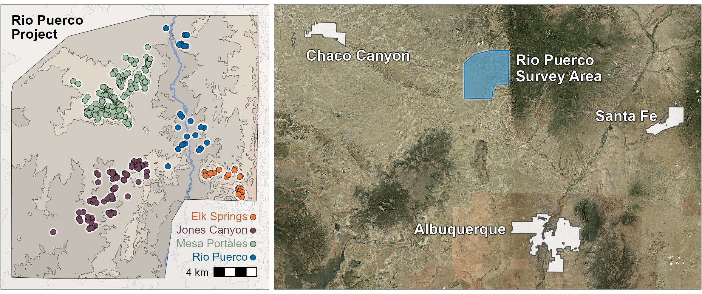{width="100%"
fig-alt="Spatial distribution of sites."}

Overview map showing location of sites and their spatial grouping (left) and
location of survey area in the wider region (right).
:::

## Analysis

#### **What does the combined ceramic assemblage look like in each region?**

```{r}

type_distributions <- ceramics |>
  group_by(region, ware, type) |>
  summarize(count = sum(count)) |>
  ungroup()

```

```{r}
#| code-fold: true

ceramic_dates <- ceramics |>
  group_by(type) |>
  slice(1) |>
  mutate(range = paste(start, end, sep = "-")) |>
  select(type, range)

tbl <- type_distributions |>
  pivot_wider(
    names_from = region,
    values_from = count,
    values_fill = 0
  ) |>
  arrange(ware, type) |>
  ungroup()

tbl_region_ceramics <- tbl |>
  left_join(ceramic_dates, by = "type") |>
  mutate(
    type = str_remove(type, " Ware"),
    type = str_remove(type, " panel design")
  ) |>
  select(type, range, es, jch, mp, rp) |>
  kbl(
    col.names = c(" ", " ", unname(region_labels)),
    align = c("lrrrrr"),
    table.attr = "class='kibble'",
    escape = FALSE
  ) |>
  pack_rows(index = table(tbl[["ware"]])) |>
  column_spec(2:6, width = "12%")

remove(tbl)

tbl_region_ceramics |>
  kable_styling(bootstrap_options = c("hover", "condensed")) |>
  scroll_box(height = "450px")

```

#### **How abundant are decorated ceramics relative to undecorated ceramics?**

There are a number of ways to estimate abundance. Here we use the ratio
$\lambda_{i}$ of decorated to undecorated ceramics at site $i$:

$$\lambda_{i} = \frac{d_{i}}{u_{i}}$$

where $d_{i}$ and $u_{i}$ are the number of decorated and undecorated ceramics
at $i$.

```{r}

abundance <- ceramics |>
  select(site_id, region, use, count) |>
  group_by(site_id, use) |>
  summarize(
    count = sum(count),
    region = unique(region)
  ) |>
  pivot_wider(names_from = "use", values_from = "count") |>
  ungroup() |>
  mutate(ratio = decorated / utility) |>
  select(site_id, region, ratio)

```

```{r}
#| code-fold: true

lbls <- tibble(
  y = 0.98,
  label = unname(region_labels),
  region = names(region_labels)
)

gg <- ggplot() +
  geom_histogram(
    data = abundance |> filter(ratio <= 2),
    aes(ratio, after_stat(ncount), fill = region, color = region),
    binwidth = 0.1,
    center = 0.05,
    linewidth = 0.2
  ) +
  geom_text(
    data = lbls,
    aes(x = 2, y = y, label = label),
    size = 12 / .pt,
    hjust = 1,
    vjust = 1,
    color = darken(region_colors, 0.2)
  ) +
  scale_color_manual(
    name = NULL,
    values = region_colors
  ) +
  scale_fill_manual(
    name = NULL,
    values = alpha(region_colors, 0.8)
  ) +
  scale_y_continuous(breaks = c(0, 0.5, 1)) +
  facet_wrap(
    vars(region),
    ncol = 2
  ) +
  labs(
    x = pretty_labels("ratio"),
    y = "Normalized Count of Sites"
  ) +
  theme(
    legend.position = "none",
    panel.grid.major = element_line(color = "grey92", linewidth = 0.4),
    strip.text = element_blank()
  )

fn <- here("figures", "abundance-of-decorated.png")

ggsave(
  plot = gg,
  filename = fn,
  width = 5.5,
  height = 5,
  dpi = 300
)

prepare_image(fn)

remove(lbls, gg, fn)

```

::: {#fig-abundance}
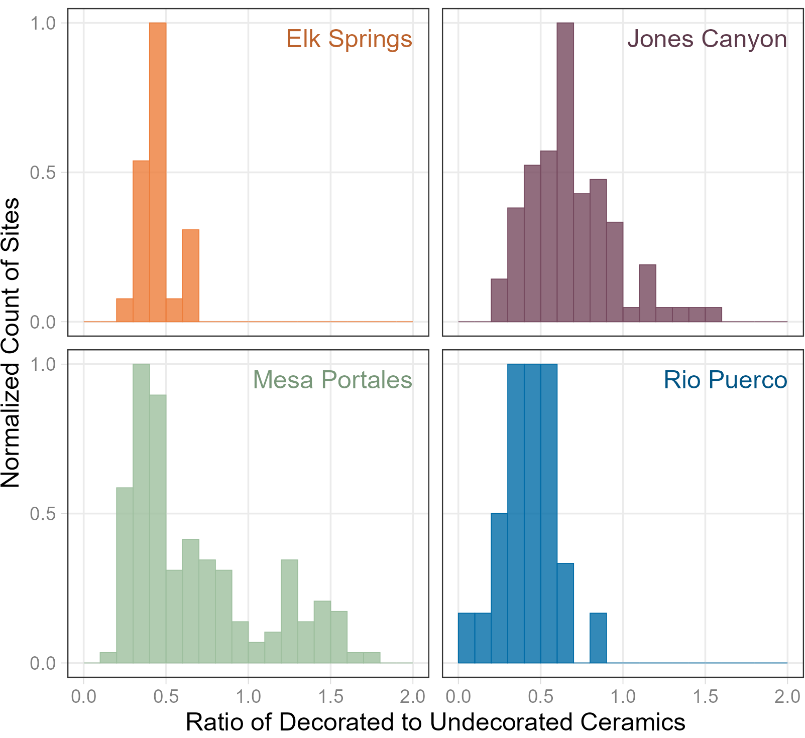{width="60%"
fig-alt="Figure shows abundance of decorated ceramics relative to utility types."}

Figure shows abundance of decorated ceramics relative to utility types.
:::

#### **Is relative abundance a function of site size?**

We estimate the relationship using a log-log linear model, with site size
measured in units of area, specifically m$^2$.

```{r}

abundance <- abundance |>
  left_join(
    sites |> st_drop_geometry() |> select(site_id, mound_area, kiva_area),
    by = "site_id"
  ) |>
  mutate(site_area = mound_area + kiva_area) |>
  select(region, site_id, ratio, site_area)

abundance_model <- lm(
  log(ratio) ~ log(site_area),
  data = abundance
)

```

```{r}
#| code-fold: true

tbl <- abundance_model |>
  tidy() |>
  rename_with(str_replace, pattern = "\\.", replacement = " ") |>
  rename_with(str_to_title) |>
  rename(
    "t Value" = Statistic,
    "p Value" = "P Value"
  ) |>
  mutate(across(2:5, \(x){
    round(x, 4)
  }))

tbl_regression <- tbl |> kbl(table.attr = "class='kibble'")

remove(tbl)

tbl_regression |>
  kable_styling(
    bootstrap_options = "hover",
    full_width = FALSE,
    position = "left"
  )

```

Here is the shape of that dependence.

```{r}
#| code-fold: true

site_area <- with(
  abundance,
  seq(min(site_area), max(site_area), length = 100)
)

dependence <- predict_response(
  abundance_model,
  terms = list("site_area" = site_area),
  back_transform = FALSE
)

gg <- ggplot() +
  geom_point(
    data = abundance,
    aes(x = log(site_area), y = log(ratio), color = region),
    size = 1.3,
    alpha = 0.9
  ) +
  scale_color_manual(
    name = NULL,
    values = region_colors,
    labels = paste(
      "<span style='color: ", darken(region_colors, 0.2), "'>",
      region_labels,
      "</span>"
    )
  ) +
  geom_ribbon(
    data = dependence,
    aes(x = log(x), ymin = conf.low, ymax = conf.high),
    color = "#fd4d00",
    fill = lighten("#fd4d00", 0.2),
    linewidth = 0.3,
    alpha = 0.5
  ) +
  geom_line(
    data = dependence,
    aes(x = log(x), y = predicted),
    color = "#fd4d00",
    linewidth = 1
  ) +
  labs(
    x = "Natural Log of Site Area [log sq.m]",
    y = "Natural Log of Ratio of\nDecorated to Undecorated Ceramics"
  ) +
  theme(
    legend.box.margin = margin(),
    # legend.justification = c(0, 1),
    legend.margin = margin(),
    legend.text = element_markdown(),
    panel.grid.major = element_line(color = "grey92", linewidth = 0.4)
  )

fn <- here("figures", "abundance-dependence.png")

ggsave(
  plot = gg,
  filename = fn,
  width = 5.25,
  height = 3.8,
  dpi = 300
)

prepare_image(fn)

remove(dependence, gg, fn)

```

::: {#fig-abundance-dependence}
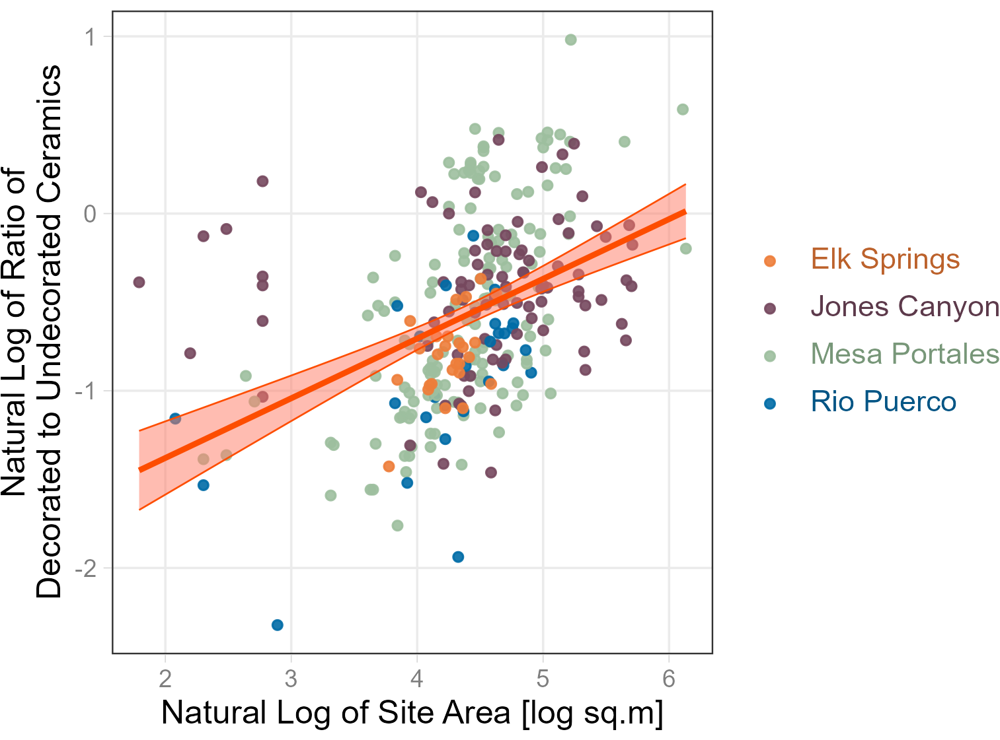{width="60%"
fig-alt="Figure shows response of abundance of decorated ceramics to site size."}

Figure shows response of abundance of decorated ceramics to site size. Note that
the x and y axes both have log scales.
:::

And here are some linear model diagnostics.

```{r}
#| fig-align: center
#| out-width: 85%

check_model(
  abundance_model,
  check = c("qq", "linearity", "homogeneity", "outliers"),
  detrend = FALSE
)

```

Looks like there's some non-linearity and heteroskedasticity in this model. This
is probably owing to the fact that we are modeling the log of a ratio and
probably also the fact that there's likely spatial and temporal structure in the
data.

#### **Does the mean of that relationship vary by region?**

This is basically an ANOVA to test for significant differences in the mean of
each group while controlling for mound area. The reference group in this model
is Elk Springs.

```{r}

regional_abundance_model <- lm(
  log(ratio) ~ log(site_area) + region,
  data = abundance
)

```

```{r}
#| code-fold: true

regional_abundance_model |>
  tidy() |>
  mutate(
    term = case_when(
      term == "regionjch" ~ "region: Jones Canyon",
      term == "regionmp" ~ "region: Mesa Portales",
      term == "regionrp" ~ "region: Rio Puerco",
      TRUE ~ term
    )
  ) |>
  rename_with(str_replace, pattern = "\\.", replacement = " ") |>
  rename_with(str_to_title) |>
  rename(
    "t Value" = Statistic,
    "p Value" = "P Value"
  ) |>
  mutate(across(2:5, \(x){
    round(x, 4)
  })) |>
  kbl(
    caption = "Coefficient Estimates",
    table.attr = "class='kibble'"
  ) |>
  kable_styling(
    bootstrap_options = "hover",
    full_width = FALSE,
    position = "left"
  )

```

Here is the shape of that dependence.

```{r}
#| code-fold: true

dependence <- predict_response(
  regional_abundance_model,
  terms = list(
    "site_area" = site_area,
    region = unique(abundance[["region"]])
  ),
  back_transform = FALSE
)

lbls <- tibble(
  x = min(log(dependence[["x"]])),
  y = log(max(abundance[["ratio"]])),
  label = unname(region_labels),
  group = names(region_labels)
)

gg <- ggplot(dependence, aes(log(x), color = group, fill = group)) +
  geom_point(
    data = abundance |> rename("group" = region),
    aes(x = log(site_area), y = log(ratio), color = group),
    size = 1.3,
    alpha = 0.7
  ) +
  geom_ribbon(
    aes(ymin = conf.low, ymax = conf.high),
    linewidth = 0.3,
    alpha = 0.5
  ) +
  geom_line(
    aes(y = predicted),
    linewidth = 1
  ) +
  geom_text(
    data = lbls,
    aes(x, y, label = label),
    size = 13 / .pt,
    hjust = 0,
    vjust = 1,
    color = darken(region_colors, 0.2)
  ) +
  scale_color_manual(name = NULL, values = region_colors) +
  scale_fill_manual(name = NULL, values = lighten(region_colors, 0.2)) +
  facet_wrap(
    vars(group),
    ncol = 2
  ) +
  labs(
    x = "Natural Log of Mound Area [log sq.m]",
    y = "Natural Log of Ratio of\nDecorated to Undecorated Ceramics"
  ) +
  theme(
    legend.position = "none",
    panel.grid.major = element_line(color = "grey92", linewidth = 0.3),
    strip.text = element_blank()
  )

fn <- here("figures", "regional-abundance-dependence.png")

ggsave(
  plot = gg,
  filename = fn,
  width = 5.5,
  height = 5,
  dpi = 300
)

prepare_image(fn)

remove(dependence, lbls, gg, fn)

```

::: {#fig-regional-abundance-dependence}
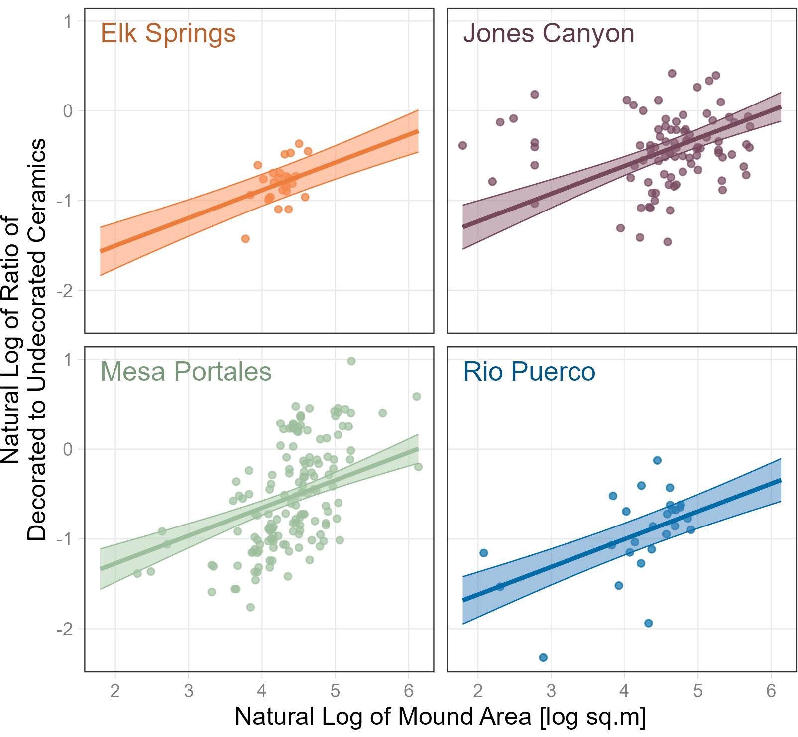{width="60%"
fig-alt="Figure shows response of abundance of decorated ceramics to site size by region."}

Figure shows response of abundance of decorated ceramics to site size by region.
Note that the x and y axes both have log scales.
:::

And the linear model diagnostics.

```{r}
#| fig-align: center
#| out-width: 85%

check_model(
  regional_abundance_model,
  check = c("qq", "linearity", "homogeneity", "outliers"),
  detrend = FALSE
)

```

Still quite a bit of non-linearity and heteroskedasticity, but you will notice
that a lot of that has been tamed relative to the simpler model.

#### **But is the added complexity in the model actually worth it?**

```{r}

complexity <- anova(
  abundance_model,
  regional_abundance_model
)

```

```{r}
#| code-fold: true

complexity |>
  tidy() |>
  rename_with(str_replace, pattern = "\\.", replacement = " ") |>
  rename_with(str_to_title) |>
  rename(
    "F" = Statistic,
    "p Value" = "P Value"
  ) |>
  mutate(
    across(2:7, \(x){
      round(x, 4)
    }),
    across(4:7, \(x){
      ifelse(is.na(x), "--", x)
    })
  ) |>
  kbl(
    caption = "Analysis of Variance Table",
    align = c("lrrrrrr"),
    table.attr = "class='kibble'"
  ) |>
  kable_styling(
    bootstrap_options = "hover",
    full_width = FALSE,
    position = "left"
  )

```

#### **How do sites correspond in terms of their decorated ceramic assemblage?**

This is estimated using correspondence analysis applied to the count matrix of
decorated ceramic types (rows are sites, columns are ceramic types).

```{r}

count_matrix <- ceramics |>
  filter(use == "decorated") |>
  select(site_id, key, count) |>
  pivot_wider(
    names_from = "key",
    values_from = "count",
    values_fill = 0
  )

correspondence <- ca(count_matrix[, -1])

```

```{r}
#| code-fold: true

rowcoord <- correspondence[["rowcoord"]]
colcoord <- correspondence[["colcoord"]]

i <- nrow(rowcoord)
j <- ncol(rowcoord)
k <- nrow(colcoord)

sv <- correspondence[["sv"]]

svF <- matrix(
  rep(sv[1:j], i),
  nrow = i,
  ncol = j,
  byrow = TRUE
)

svG <- matrix(
  rep(sv[1:j], k),
  nrow = k,
  ncol = j,
  byrow = TRUE
)

rpc <- rowcoord * svF
cpc <- colcoord * svG

row_data <- tibble(
  site_id = count_matrix[, 1, drop = TRUE],
  x = rpc[, 1],
  y = rpc[, 2]
)

row_data <- row_data |>
  left_join(
    sites |> st_drop_geometry() |> select(site_id, region),
    by = "site_id"
  )

col_data <- tibble(
  x = cpc[, 1],
  y = cpc[, 2]
)

col_labels <- tibble(
  x = cpc[, 1],
  y = cpc[, 2],
  label = correspondence[["colnames"]]
) |>
  mutate(
    gx = ifelse(x <= median(x), -0.5, 0.5),
    gy = ifelse(y <= median(y), -0.5, 0.5)
  )

pct <- round(100 * (sv^2) / sum(sv^2), 1)[c(1, 2)]

remove(rowcoord, colcoord, i, j, k, sv, svF, svG, rpc, cpc)

gg <- ggplot() +
  geom_hline(
    yintercept = 0,
    color = "gray70",
    linewidth = 0.3
  ) +
  geom_vline(
    xintercept = 0,
    color = "gray70",
    linewidth = 0.3
  ) +
  geom_point(
    data = row_data,
    aes(x, y),
    shape = 21,
    color = "gray30",
    fill = alpha("gray70", 0.7),
    size = 2,
    stroke = 0.1
  ) +
  geom_label_repel(
    data = col_labels,
    aes(x, y, label = label),
    size = 10 / .pt,
    force = 5,
    nudge_x = col_labels[["gx"]],
    nudge_y = col_labels[["gy"]]
  ) +
  geom_point(
    data = col_data,
    aes(x, y),
    shape = 24,
    color = "gray30",
    fill = "#fd4d00",
    size = 2.5,
    stroke = 0.1
  ) +
  labs(
    x = paste0("Dimension 1 [", pct[1], "%]"),
    y = paste0("Dimension 2 [", pct[2], "%]")
  ) +
  theme_bw(12) +
  theme(
    legend.position = "none",
    panel.grid = element_blank()
  )

fn <- here("figures", "correspondence.png")

ggsave(
  plot = gg,
  filename = fn,
  width = 5,
  height = 4,
  dpi = 300
)

prepare_image(fn)

remove(col_data, col_labels, gg, fn)

```

::: {#fig-correspondence}
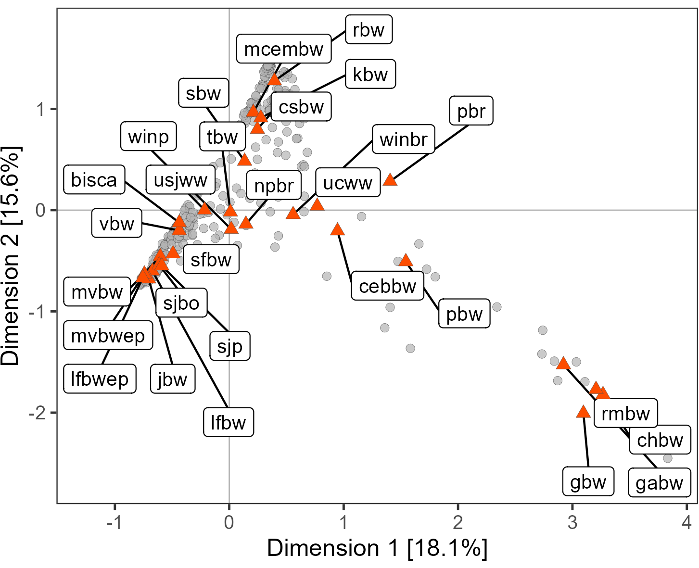{width="60%"
fig-alt="Figure shows results of correspondence analysis."}

Figure shows results of correspondence analysis for first two dimensions.
:::

Here is a key to help interpret that figure.

```{r}
#| code-fold: true

keys <- ceramics |>
  filter(use == "decorated") |>
  group_by(type) |>
  summarize(key = unique(key)) |>
  relocate(key)

keys <- bind_cols(
  keys |> slice(1:14),
  keys |> slice(15:28)
)

keys |>
  kbl(
    col.names = rep(" ", 4),
    table.attr = "class='kibble'",
  ) |>
  kable_styling(bootstrap_options = "condensed") |>
  scroll_box(height = "450px")

```

#### **What does the correspondence look like by region?**

```{r}
#| code-fold: true

gg_regions <- ggplot() +
  geom_hline(
    yintercept = 0,
    color = "gray70",
    linewidth = 0.3
  ) +
  geom_vline(
    xintercept = 0,
    color = "gray70",
    linewidth = 0.3
  ) +
  geom_point(
    data = row_data,
    aes(x, y, fill = region),
    shape = 21,
    color = "gray30",
    stroke = 0.1,
    size = 3
  ) +
  geom_point(
    data = tibble(
      x = 3.8,
      y = c(1.50, 1.25, 1.00, 0.75),
      region = c("es", "jch", "mp", "rp")
    ),
    aes(x, y, fill = region),
    shape = 21,
    color = "gray30",
    stroke = 0.1,
    size = 2.5
  ) +
  geom_text(
    data = tibble(
      x = 3.67,
      y = c(1.50, 1.25, 1.00, 0.75),
      region = c("es", "jch", "mp", "rp"),
      label = region_labels
    ),
    aes(x, y, label = label, color = region),
    size = 11 / .pt,
    hjust = 1,
    vjust = 0.4
  ) +
  scale_color_manual(
    name = NULL,
    values = darken(region_colors, 0.2)
  ) +
  scale_fill_manual(
    name = NULL,
    values = alpha(region_colors, 0.85)
  ) +
  labs(
    x = paste0("Dimension 1 [", pct[1], "%]"),
    y = paste0("Dimension 2 [", pct[2], "%]")
  ) +
  scale_x_continuous(limits = c(-0.8, 3.9), breaks = -0:3) +
  scale_y_continuous(breaks = -2:1) +
  theme_bw(12) +
  theme(
    legend.position = "none",
    panel.grid = element_blank()
  )

fn <- here("figures", "correspondence-regions.png")

ggsave(
  plot = gg_regions,
  filename = fn,
  width = 5,
  height = 4,
  dpi = 300
)

prepare_image(fn)

remove(row_data, fn)

```

::: {#fig-correspondence-regions}
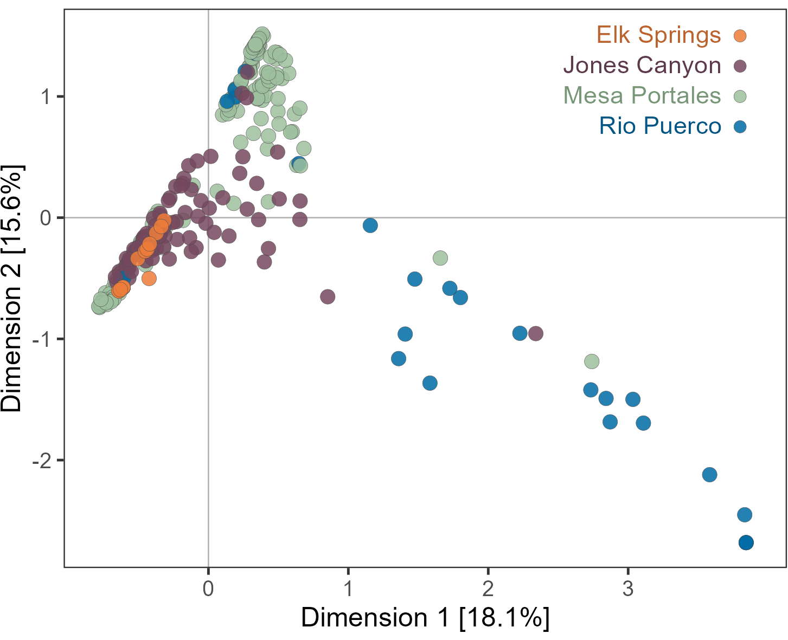{width="60%"
fig-alt="Figure shows results of correspondence analysis color-coded by region."}

Figure shows results of correspondence analysis color-coded by region.
:::

#### **What temporal groups emerge from the correspondence?**

```{r}

# calculate principal coordinates for rows (i.e., sites)
rowcoord <- correspondence[["rowcoord"]]

# singular values
sv <- correspondence[["sv"]]

# row principal coordinates
rpc <- rowcoord %*% diag(sv)

# how many groups?
k <- 5

# kmeans just on the first two dimensions
clusters <- kmeans(
  rpc[, 1:2],
  centers = k
)

# dimension 1 is basically time
phase_centers <- clusters[["centers"]][, 1, drop = TRUE]

names(phase_centers) <- 1:k

# oldest to the right, youngest to the left
phase_centers <- sort(phase_centers, decreasing = TRUE)

# the names of phase_centers are the integer IDs of the clusters
# now we set the values to the Pecos phase names
phase_centers[1:k] <- names(phase_colors)

# the cluster vector is the integer IDs of the cluster,
# of length equal to the number of rows (i.e., sites)
# by converting this to character, we can subset the phase_centers vector
# based on its names, the result being a vector of Pecos phase names
clusters <- as.character(clusters[["cluster"]])

phases <- tibble(
  site_id = count_matrix[, 1, drop = TRUE],
  x = rpc[, 1],
  y = rpc[, 2],
  phase = phase_centers[clusters]
)

remove(rowcoord, sv, rpc, k, clusters, phase_centers)

```

```{r}
#| code-fold: true

ceramic_counts <- ceramics |>
  group_by(site_id) |>
  summarize(count = sum(count))

phases <- phases |> left_join(ceramic_counts, by = "site_id")

gg_groups <- ggplot() +
  geom_hline(
    yintercept = 0,
    color = "gray70",
    linewidth = 0.3
  ) +
  geom_vline(
    xintercept = 0,
    color = "gray70",
    linewidth = 0.3
  ) +
  geom_point(
    data = phases,
    aes(x, y, fill = phase, size = count),
    shape = 21,
    color = "gray30",
    stroke = 0.2
  ) +
  geom_point(
    data = tibble(
      x = 3.8,
      y = c(1.50, 1.25, 1.00, 0.75, 0.50),
      phase = names(phase_colors)
    ),
    aes(x, y, fill = phase),
    shape = 21,
    color = "gray30",
    stroke = 0.1,
    size = 2.5
  ) +
  geom_text(
    data = tibble(
      x = 3.67,
      y = c(1.50, 1.25, 1.00, 0.75, 0.50),
      phase = names(phase_colors)
    ),
    aes(x, y, label = phase, color = phase),
    size = 11 / .pt,
    hjust = 1,
    vjust = 0.4
  ) +
  scale_color_manual(
    name = NULL,
    values = darken(phase_colors, 0.2)
  ) +
  scale_fill_manual(
    name = NULL,
    values = alpha(phase_colors, 0.8)
  ) +
  annotate(
    "text",
    x = -0.8,
    y = -2.6,
    label = "*Point size represents relative ceramic count.",
    hjust = 0,
    vjust = 0,
    color = "gray35",
    size = 10 / .pt
  ) +
  labs(
    x = paste0("Dimension 1 [", pct[1], "%]"),
    y = paste0("Dimension 2 [", pct[2], "%]")
  ) +
  scale_x_continuous(limits = c(-0.8, 3.9), breaks = -0:3) +
  scale_y_continuous(breaks = -2:1) +
  theme_bw(12) +
  theme(
    legend.position = "none",
    panel.grid = element_blank()
  )

fn <- here("figures", "correspondence-groups.png")

ggsave(
  plot = gg_groups,
  filename = fn,
  width = 5,
  height = 4,
  dpi = 300
)

prepare_image(fn)

remove(ceramic_counts, pct)

```

::: {#fig-correspondence-groups}
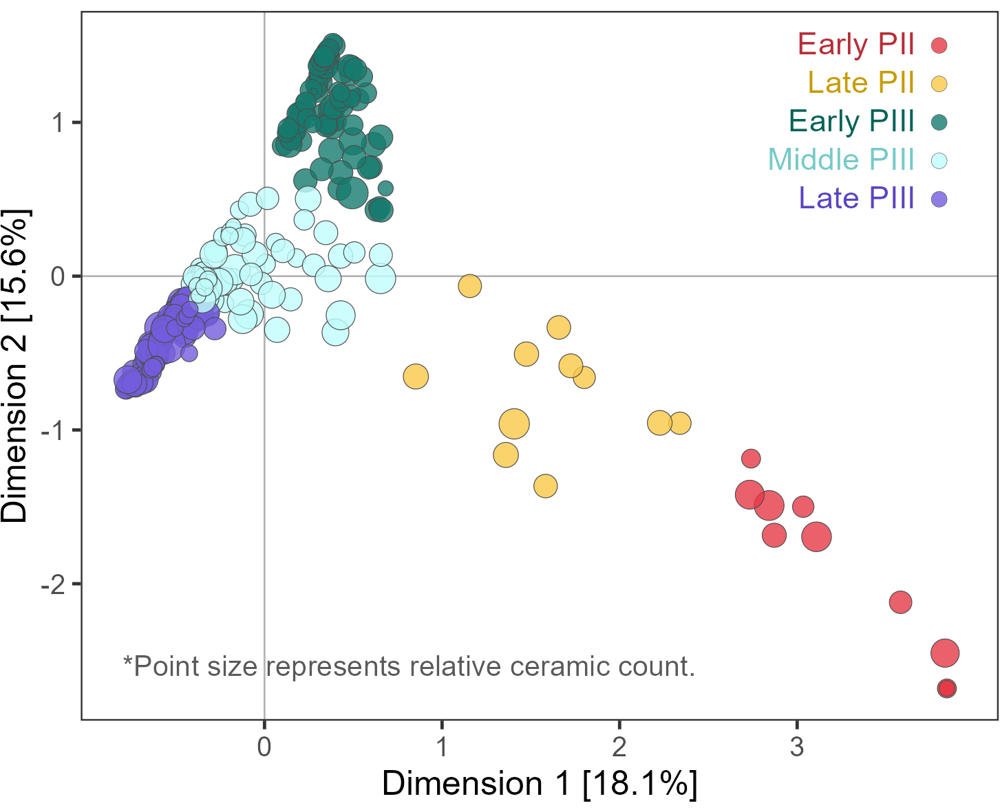{width="60%"
fig-alt="Figure shows groups defined by kmeans applied to correspondence analysis."}

Figure shows groups defined by kmeans applied to correspondence analysis.
:::

```{r}
#| code-fold: true

# combining the previous two figures

gg_regions <- gg_regions + theme(plot.margin = margin(r = 2))

gg_groups <- gg_groups + theme(
  axis.text.y = element_blank(),
  axis.ticks.y = element_blank(),
  axis.title.y = element_blank(),
  plot.margin = margin(l = 2)
)

fn <- here("figures", "correspondence-combined.png")

ggsave(
  plot = gg_regions + gg_groups + plot_layout(axis_titles = "collect"),
  filename = fn,
  width = 7.5,
  height = 4,
  dpi = 300
)

prepare_image(fn)

remove(gg_regions, gg_groups)

```

#### **What does the combined ceramic assemblage look like in each time period?**

```{r}

type_distributions <- phases |>
  select(site_id, phase) |>
  left_join(ceramics, by = "site_id") |>
  group_by(phase, ware, type) |>
  summarize(count = sum(count)) |>
  ungroup()

```

```{r}
#| code-fold: true

tbl <- type_distributions |>
  pivot_wider(
    names_from = phase,
    values_from = count,
    values_fill = 0
  ) |>
  arrange(ware, type) |>
  relocate(
    `Early PII`, `Late PII`, `Early PIII`, `Middle PIII`, `Late PIII`,
    .after = type
  ) |>
  left_join(ceramic_dates, by = "type") |>
  mutate(
    type = str_remove(type, " Ware"),
    type = str_remove(type, " panel design")
  )

col_names <- c(
  " ",
  " ",
  str_split_i(names(phase_colors), pattern = " ", i = 1)
)

tbl_period_ceramics <- tbl |>
  select(-ware) |>
  relocate(type, range) |>
  kbl(
    col.names = col_names,
    align = c("lrrrrrr"),
    table.attr = "class='kibble two-head'",
    escape = FALSE
  ) |>
  pack_rows(index = table(tbl[["ware"]])) |>
  column_spec(2, width = "12%") |>
  column_spec(3:7, width = "9.4%") |>
  add_header_above(
    header = c(" " = 2, "Pueblo II" = 2, "Pueblo III" = 3),
    align = "right",
    bold = TRUE,
    line_sep = 3
  )

remove(tbl, col_names)

tbl_period_ceramics |>
  kable_styling(bootstrap_options = c("hover", "condensed")) |>
  scroll_box(height = "450px")
```

#### **What does that correspondence look like geographically?**

```{r}

site_phases <- sites |>
  left_join(phases, by = "site_id") |>
  select(site_id, region, fnum, phase) |>
  filter(!is.na(phase))

```

```{r}
#| code-fold: true

bb8 <- survey_area |>
  st_buffer(1000) |>
  st_bbox()

dx <- bb8[["xmax"]] - bb8[["xmin"]]
dy <- bb8[["ymax"]] - bb8[["ymin"]]

cover <- st_sym_difference(survey_area, st_as_sfc(bb8))

lbls <- tibble(
  x = st_bbox(survey_area)[["xmax"]] - 500,
  y = st_bbox(survey_area)[["ymin"]] + seq(1950, 5950, length = 5),
  phase = rev(names(phase_colors))
)

gg <- ggplot() +
  geom_spatraster_contour_filled(
    data = elevation,
    bins = 10,
    color = "gray30",
    linewidth = 0.1
  ) +
  scale_fill_cross_blended_d(
    palette = "arid",
    alpha = 0.7,
    guide = "none"
  ) +
  ggnewscale::new_scale_fill() +
  geom_sf(
    data = survey_area,
    fill = "transparent",
    color = "black"
  ) +
  geom_sf(
    data = cover,
    fill = alpha("white", 0.7),
    color = "transparent"
  ) +
  geom_sf(
    data = rio_puerco |> st_intersection(survey_area),
    color = "#7A96C2",
    linewidth = 0.5
  ) +
  with_outer_glow(
    geom_sf(
      data = site_phases,
      aes(fill = fct_relevel(phase, "Early PII", "Middle PII", "Late PII")),
      size = 2.75,
      shape = 21,
      color = "black",
      stroke = 0.2
    ),
    colour = "white",
    expand = 3.5,
    sigma = 2
  ) +
  scale_fill_manual(
    name = NULL,
    values = alpha(phase_colors, 0.85)
  ) +
  geom_sf(
    data = st_as_sfc(bb8),
    fill = "transparent",
    color = "black"
  ) +
  geom_point(
    data = lbls,
    aes(x, y, fill = phase),
    size = 2.75,
    shape = 21,
    color = "black",
    stroke = 0.2
  ) +
  geom_text(
    data = lbls,
    aes(x, y, label = phase, color = phase),
    size = 12 / .pt,
    hjust = 1,
    vjust = 0.45,
    nudge_x = -500
  ) +
  scale_color_manual(
    name = NULL,
    values = darken(phase_colors, 0.2)
  ) +
  annotate(
    "text",
    x = st_bbox(survey_area)[["xmin"]],
    y = st_bbox(survey_area)[["ymax"]],
    label = "Rio Puerco Project",
    size = 14 / .pt,
    hjust = 0,
    vjust = 1,
    fontface = "bold"
  ) +
  annotation_scale(
    aes(location = "br"),
    text_cex = 0.9,
    pad_x = unit(0.7, "cm"),
    pad_y = unit(0.65, "cm")
  ) +
  coord_sf(
    crs = 26913,
    datum = 26913,
    expand = FALSE,
    xlim = bb8[c("xmin", "xmax")],
    ylim = bb8[c("ymin", "ymax")]
  ) +
  theme_void(12) +
  theme(legend.position = "none")

ggsave(
  plot = gg,
  filename = here("figures", "correspondence-map.png"),
  width = 5,
  height = 5 * (dy / dx),
  dpi = 300,
  bg = "white"
)

remove(bb8, dx, dy, cover, gg, lbls)

```

::: {#fig-correspondence-map}
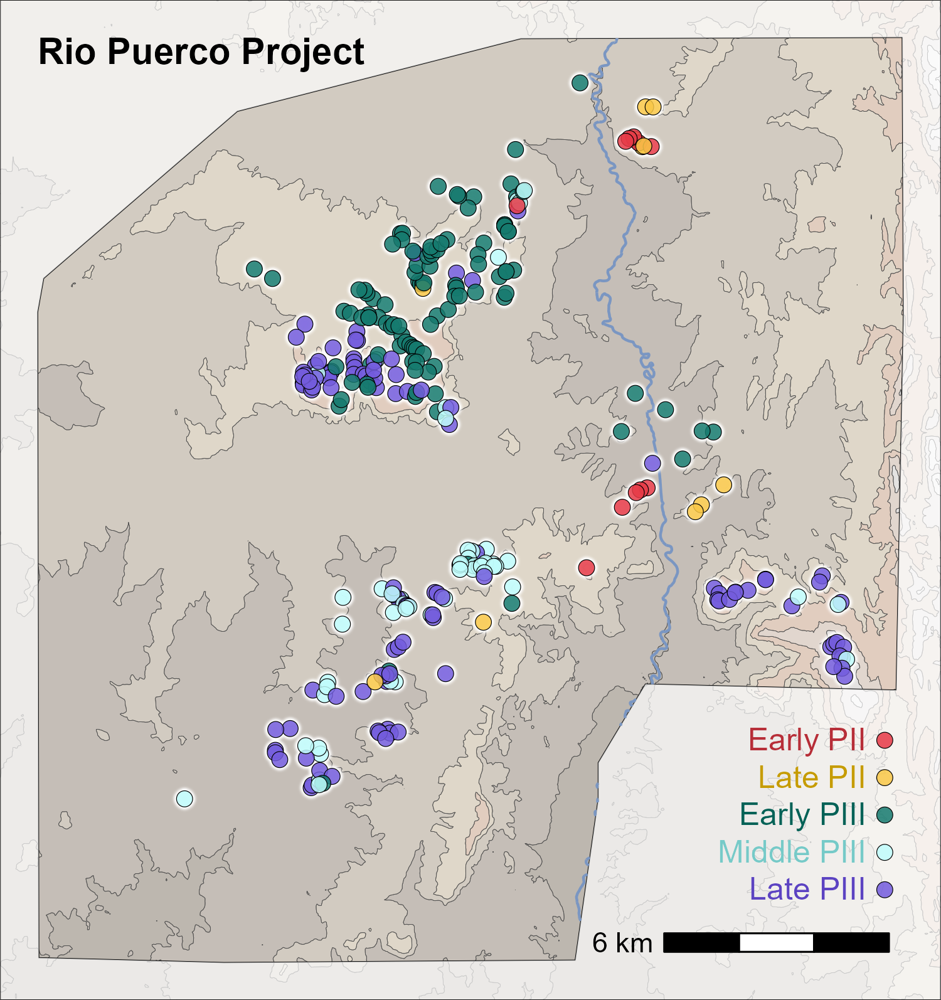{width="60%"
fig-alt="Figure shows geographic distribution of correspondence groups."}

Figure shows geographic distribution of correspondence groups.
:::

#### **How do site characteristics vary by region and time period?**

Here, we measure the following site characteristics for each time period and
region:

-   Site `count`
-   Site `area` or size (`mound_area` + `kiva_area`), total and median
-   Fraction of `burn`ed sites
-   Site `orientation`

```{r}

site_characteristics <- sites |>
  st_drop_geometry() |>
  mutate(
    area = mound_area + kiva_area,
    burn = ifelse(burn == "Yes", 1L, 0L)
  ) |>
  inner_join(phases[c("site_id", "phase")], by = "site_id") |>
  group_by(region, phase) |>
  summarize(
    count = n(),
    area_t = sum(area),
    area_m = median(area),
    burn = mean(burn),
    orientation = median(orientation)
  ) |>
  ungroup() |>
  complete(
    region,
    phase,
    fill = list(area_t = 0, area_m = 0, burn = 0, count = 0)
  )

```

```{r}
#| code-fold: true

tbl <- site_characteristics |>
  mutate(
    across(count:orientation, \(x){
      round(x, digits = 2)
    }),
    across(count:orientation, \(x){
      ifelse(is.na(x), "--", format(x, nsmall = 2))
    }),
    count = gsub(".00", "", count),
    region = region_labels[region]
  ) |>
  pivot_longer(
    count:orientation,
    names_to = "characteristic",
    values_to = "value"
  ) |>
  group_by(characteristic, phase) |>
  summarize(
    region = paste0(region, collapse = "<br>"),
    value = paste0(value, collapse = "<br>")
  ) |>
  ungroup() |>
  pivot_wider(
    names_from = "phase",
    values_from = "value"
  ) |>
  relocate(
    `Early PII`, `Late PII`, `Early PIII`, `Middle PIII`, `Late PIII`,
    .after = region
  ) |>
  mutate(
    i = case_when(
      characteristic == "count" ~ 1,
      characteristic == "area_t" ~ 2,
      characteristic == "area_m" ~ 3,
      characteristic == "burn" ~ 4,
      characteristic == "orientation" ~ 5
    ),
    characteristic = case_when(
      characteristic == "count" ~ "<strong>A. N Sites</strong>",
      characteristic == "area_t" ~ "<strong>B. Area</strong><br>[total m&#178;]",
      characteristic == "area_m" ~ "<strong>C. Area</strong><br>[median m&#178;]",
      characteristic == "burn" ~ "<strong>D. Burned</strong><br>[mean] (Yes, No)",
      characteristic == "orientation" ~ "<strong>E. Orientation<br>of Roomblock</strong><br>[median degrees]"
    )
  ) |>
  arrange(i) |>
  select(-i)


tbl_site_characteristics <- tbl |>
  kbl(
    col.names = c(" ", " ", names(phase_colors)),
    align = c("llrrrrr"),
    table.attr = "class='kibble lines'",
    escape = FALSE
  )

remove(tbl)

tbl_site_characteristics |>
  kable_styling(bootstrap_options = c("hover", "condensed"))
```

#### **How are sites oriented through time?**

And now for some trigonometry...

```{r}
#| code-fold: true

bb8 <- survey_area |>
  st_buffer(1000) |>
  st_bbox()

cover <- st_sym_difference(survey_area, st_as_sfc(bb8))

lbls <- tibble(
  x = st_bbox(survey_area)[["xmin"]],
  y = st_bbox(survey_area)[["ymax"]],
  phase = factor(names(phase_colors), levels = names(phase_colors))
)

r <- 1750

circles <- sites |>
  inner_join(phases[c("site_id", "phase")], by = "site_id") |>
  group_by(region, phase) |>
  summarize() |>
  ungroup() |>
  st_centroid() |>
  st_buffer(r) |>
  mutate(phase = factor(phase, levels = names(phase_colors)))

xy <- circles |>
  st_centroid() |>
  st_coordinates() |>
  as_tibble() |>
  rename_with(str_to_lower) |>
  mutate(
    region = circles[["region"]],
    phase = circles[["phase"]]
  )

xy <- site_characteristics |>
  select(region, phase, orientation) |>
  filter(!is.na(orientation)) |>
  left_join(xy, by = c("region", "phase")) |>
  mutate(
    orientation = ((-orientation + 90) * pi) / 180,
    xend = x + ((r - 200) * cos(orientation)),
    yend = y + ((r - 200) * sin(orientation)),
    phase = factor(phase, levels = names(phase_colors))
  )

gg <- ggplot() +
  geom_spatraster_contour_filled(
    data = elevation,
    bins = 10,
    color = "gray30",
    linewidth = 0.1
  ) +
  scale_fill_cross_blended_d(
    palette = "arid",
    alpha = 0.7,
    guide = "none"
  ) +
  ggnewscale::new_scale_fill() +
  geom_sf(
    data = survey_area,
    fill = "transparent",
    color = "black"
  ) +
  geom_sf(
    data = cover,
    fill = alpha("white", 0.7),
    color = "transparent"
  ) +
  geom_sf(
    data = rio_puerco |> st_intersection(survey_area),
    color = "#7A96C2",
    linewidth = 0.5
  ) +
  geom_sf(
    data = circles,
    color = "black",
    fill = alpha("white", 0.5),
    linewidth = 0.25
  ) +
  with_outer_glow(
    geom_segment(
      data = xy,
      aes(x, y, xend = xend, yend = yend, color = region),
      linewidth = 0.65,
      lineend = "round",
      arrow = arrow(angle = 35, type = "closed", length = unit(0.05, "inches"))
    ),
    colour = "black",
    expand = 1.5,
    sigma = 0.5
  ) +
  geom_sf(
    data = st_as_sfc(bb8),
    fill = "transparent",
    color = "black"
  ) +
  geom_text(
    data = lbls,
    aes(x, y, label = phase),
    color = "black",
    size = 11 / .pt,
    hjust = 0,
    vjust = 1
  ) +
  scale_color_manual(
    name = NULL,
    values = region_colors,
    labels = paste(
      "<span style='color: ", darken(region_colors, 0.2), "'>",
      region_labels,
      "</span>"
    )
  ) +
  facet_wrap(
    vars(phase),
    ncol = 3
  ) +
  coord_sf(
    crs = 26913,
    datum = 26913,
    expand = FALSE,
    xlim = bb8[c("xmin", "xmax")],
    ylim = bb8[c("ymin", "ymax")]
  ) +
  theme_void(12) +
  theme(
    legend.justification.inside = c("right", "bottom"),
    legend.position = "inside",
    legend.position.inside = c(0.91, 0.15),
    legend.text = element_markdown(),
    strip.text = element_blank()
  ) +
  guides(color = guide_legend(label.position = "left"))

fn <- here("figures", "orientation-map.png")

ggsave(
  plot = gg,
  filename = fn,
  width = 7,
  height = 6,
  dpi = 300,
  bg = "white"
)

prepare_image(fn)

remove(bb8, circles, xy, cover, gg, lbls, fn, r)

```

::: {#fig-orientation-map}
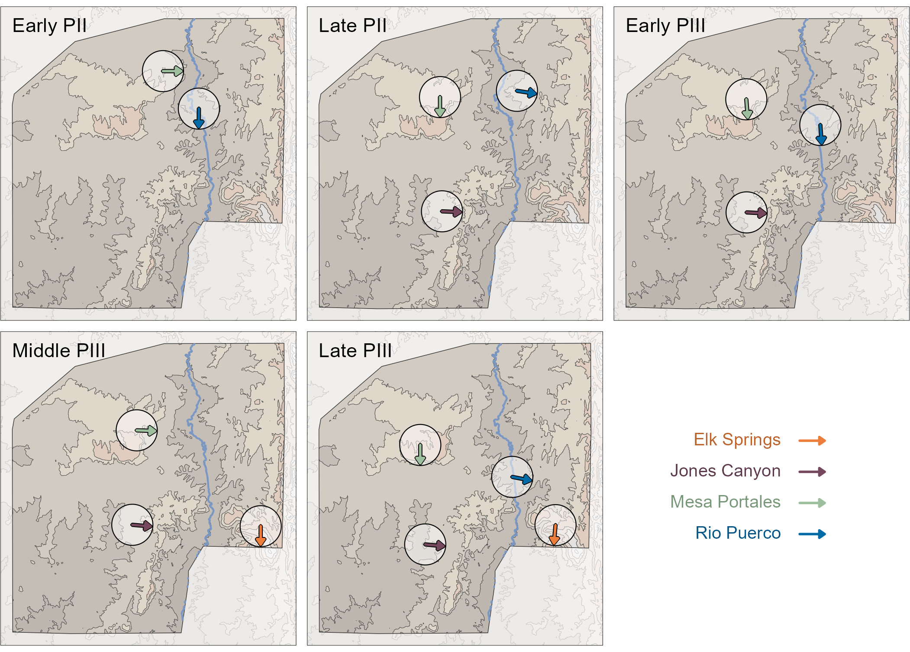{width="100%"
fig-alt="Figure shows median orientation of sites across regions and time periods."}

Figure shows median orientation of sites across regions and time periods. The
circles are positioned so that their centers roughly coincide with the centroid
of site points for each region and time period.
:::

<!--

#### **Is orientation driven by cultural affiliation?**

Ceramics frequencies are highly co-linear. Need to rethink this.

```{r}

orientation_matrix <- count_matrix |>
  left_join(sites |> st_drop_geometry() |> select(site_id, orientation)) |>
  mutate(
    orientation = cut(
      orientation,
      breaks = seq(0, 360, by = 45),
      labels = c("NNE", "ENE", "ESE", "SSE", "SSW", "WSW", "WNW", "NNW"),
      include.lowest = TRUE
    ),
    orientation = as.character(orientation),
    orientation = factor(orientation)
  ) |>
  pivot_longer(
    c(-site_id, -orientation),
    names_to = "type",
    values_to = "count"
  ) |>
  group_by(site_id) |>
  mutate(count = count / sum(count)) |>
  ungroup() |>
  pivot_wider(
    id_cols = c(site_id, orientation),
    names_from = "type",
    values_from = "count"
  ) |>
  select(-site_id)

orientation_lda <- lda(
  orientation ~ .,
  data = orientation_matrix
)

```

```{r}
#| code-fold: true

gtbl <- orientation_lda[["scaling"]] |>
  as_tibble(rownames = "type") |>
  pivot_longer(
    -type,
    names_to = "discriminant",
    values_to = "weight"
  )

gg <- ggplot(gtbl) +
  geom_vline(
    xintercept = 0,
    color = "grey25",
    linewidth = 0.2
  ) +
  geom_segment(
    aes(x = 0, xend = weight, y = type, yend = type)
  ) +
  geom_point(
    aes(weight, type),
    size = 0.75
  ) +
  facet_wrap(
    vars(discriminant),
    ncol = 4
  ) +
  labs(
    x = "Coefficients of Linear Determinants",
    y = NULL
  ) +
  theme(
    axis.text = element_text(color = "grey25"),
    strip.text = element_text(hjust = 0)
  )

fn <- here("figures", "orientation-lda-coefficients.png")

ggsave(
  plot = gg,
  filename = fn,
  width = 7,
  height = 4.5,
  dpi = 300,
  bg = "white"
)

prepare_image(fn)

remove(gtbl, fn, gg)

```

::: {#fig-orientation-lda-coefficients}
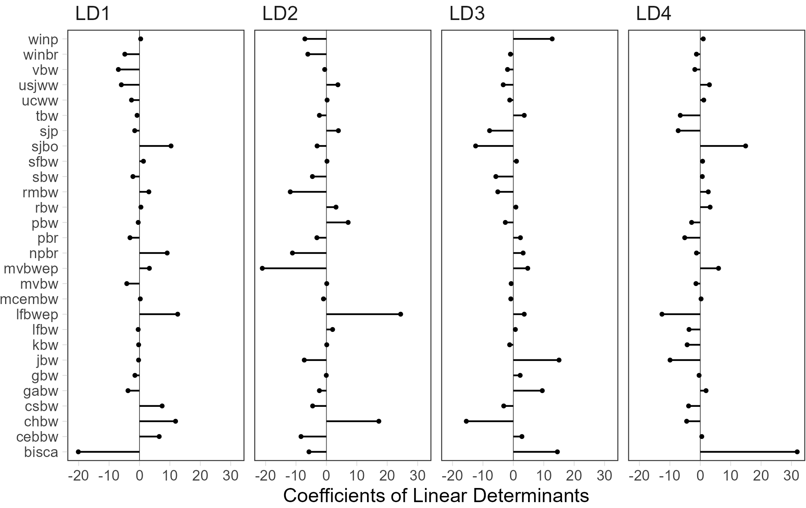{width="90%"
fig-alt="Figure shows coefficients of linear discriminants for site orientation."}

Figure shows coefficients of linear discriminants for site orientation.
:::

```{r}
#| code-fold: true

X <- orientation_matrix |>
  select(-orientation) |>
  as.matrix() |>
  scale(
    center = colMeans(orientation_lda[["means"]]),
    scale = FALSE
  )

X <- X %*% orientation_lda[["scaling"]]

plots <- map(
  1:ncol(X),
  \(i){
    plots <- map(
      1:ncol(X),
      \(j){
        if (i == j) {
          gtbl <- tibble(
            y = mean(X[, i]),
            x = mean(X[, j]),
            lbl = paste0("LD", i)
          )

          gg <- ggplot(gtbl) +
            geom_text(
              aes(x, y, label = lbl),
              size = 14 / .pt
            ) +
            theme_bw(12) +
            theme(
              axis.text = element_blank(),
              axis.ticks = element_blank()
            )
        } else {
          gtbl <- tibble(
            y = X[, i],
            x = X[, j],
            g = orientation_matrix[["orientation"]]
          )

          gg <- ggplot(gtbl) +
            geom_hline(yintercept = 0, color = "gray75", linewidth = 0.3) +
            geom_vline(xintercept = 0, color = "gray75", linewidth = 0.3) +
            geom_point(
              aes(x, y, fill = g),
              shape = 21,
              size = 1.6,
              alpha = 0.75,
              color = "gray35",
              stroke = 0.2
            ) +
            scale_fill_brewer(name = "Orientation", palette = "YlOrBr") +
            theme_bw(12)

          if (i == 1) {
            gg <- gg + scale_x_continuous(position = "top")

            if (j < ncol(X)) {
              gg <- gg +
                theme(
                  axis.text.y = element_blank(),
                  axis.ticks.y = element_blank(),
                  axis.title.y = element_blank()
                )
            } else {
              gg <- gg + scale_y_continuous(position = "right")
            }
          } else if (i == ncol(X)) {
            if (j > 1) {
              gg <- gg +
                theme(
                  axis.text.y = element_blank(),
                  axis.ticks.y = element_blank(),
                  axis.title.y = element_blank()
                )
            }
          } else {
            if (j == 1) {
              gg <- gg +
                theme(
                  axis.text.x = element_blank(),
                  axis.ticks.x = element_blank(),
                  axis.title.x = element_blank()
                )
            } else if (j > 1 && j < ncol(X)) {
              gg <- gg +
                theme(
                  axis.text = element_blank(),
                  axis.ticks = element_blank(),
                  axis.title = element_blank()
                )
            } else {
              gg <- gg +
                scale_y_continuous(position = "right") +
                theme(
                  axis.text.x = element_blank(),
                  axis.ticks.x = element_blank(),
                  axis.title.x = element_blank()
                )
            }
          }
        }

        gg +
          theme(
            axis.title = element_blank(),
            panel.grid = element_blank(),
            plot.margin = margin(1, 1, 1, 1)
          )
      }
    )
  }
)

gg <- wrap_plots(
  unlist(plots, recursive = FALSE),
  ncol = 4,
  nrow = 4,
  guides = "collect"
) &
  theme(
    legend.justification = c(0, 0),
    legend.direction = "horizontal",
    legend.margin = margin(b = 2),
    legend.position = "top",
    legend.title.position = "top"
  )

fn <- here("figures", "orientation-lda-pairs.png")

ggsave(
  plot = gg,
  filename = fn,
  width = 7,
  height = 7,
  dpi = 300,
  bg = "white"
)

prepare_image(fn)

remove(X, plots, fn, gg)

```

::: {#fig-orientation-lda-pairs}
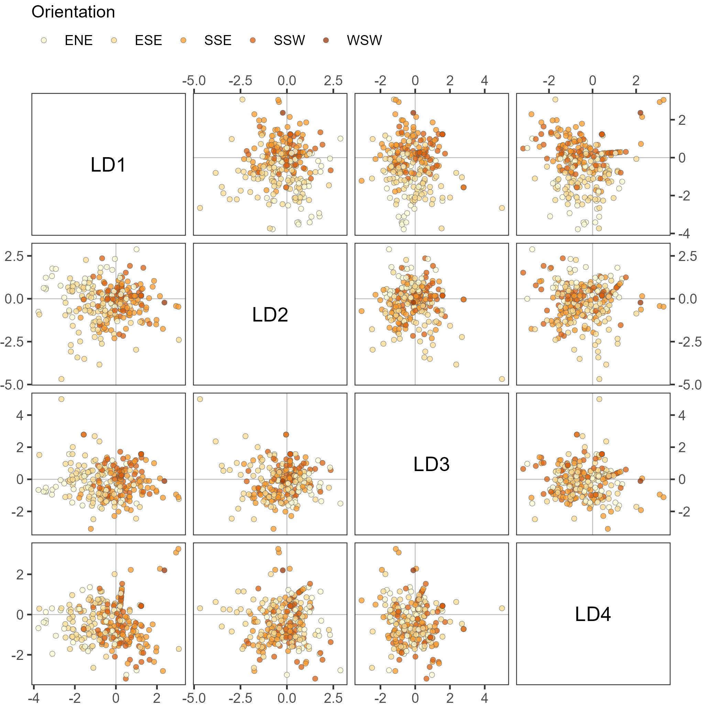{width="95%"
fig-alt="Figure shows all pairwise combinations of linear discriminants for site orientation."}

Figure shows all pairwise combinations of linear discriminants for site
orientation.
:::

```{r}
#| code-fold: true

scores <- do.call("cbind", predict(orientation_lda)) |>
  as_tibble() |>
  select(class:WSW) |>
  mutate(site = 1:n()) |>
  pivot_longer(
    -c(site, class),
    names_to = "orientation",
    values_to = "probability"
  )

group_scores <- scores |>
  group_by(site) |>
  summarize(D = diff(sort(probability))[4]) |>
  ungroup()

gg <- ggplot(group_scores, aes(D)) +
  geom_density(
    fill = "gray75",
    outline.type = "full"
    # binwidth = 0.02,
    # center = 0.01,
    # color = "white"
  ) +
  labs(
    x = "Difference in Probability\nBetween Two Highest Probabilities",
    y = NULL
  )

fn <- here("figures", "orientation-lda-discrimination.png")

ggsave(
  plot = gg,
  filename = fn,
  width = 5.35,
  height = 4.5,
  dpi = 300,
  bg = "white"
)

prepare_image(fn)

remove(var_exp, fn, gg)


```

::: {#fig-orientation-lda-ellipses}
{width="50%"
fig-alt="Figure shows 95% confidence ellipses for LDA estimates of site orientation."}

Figure shows 95% confidence ellipses for LDA estimates of site orientation.
:::

```{r}
#| code-fold: true

scores |>
  select(orientation, class) |>
  mutate(
    result = map(class, \(v){
      tibble(
        g = c("ENE", "ESE", "SSE", "SSW", "WSW"),
        p = as.integer(v == 1:5)
      )
    })
  ) |>
  unnest(result) |>
  select(-class) |>
  group_by(orientation, g) |>
  summarize(p = sum(p)) |>
  ungroup() |>
  pivot_wider(
    names_from = g,
    values_from = p
  )

```

-->

#### **What does population do over time?**

We include climate estimates from [SKOPE](https://www.openskope.org/) here.

```{r}
#| code-fold: true

phase_key <- 1L:5L
names(phase_key) <- names(phase_colors)

start_key <- c(950, 1050, 1150, 1200, 1250)
names(start_key) <- names(phase_colors)

end_key <- c(1050, 1150, 1200, 1250, 1300)
names(end_key) <- names(phase_colors)

ts_population_regions <- sites |>
  st_drop_geometry() |>
  inner_join(phases[c("site_id", "phase")], by = "site_id") |>
  group_by(region, phase) |>
  summarize(
    population = sum(mound_area + kiva_area),
    count = n()
  ) |>
  ungroup() |>
  complete(
    region, phase,
    fill = list(population = 0, count = 0, p_pop = 0, p_cnt = 0)
  ) |>
  mutate(phase_id = phase_key[phase]) |>
  arrange(region, phase_id)

ts_population_project <- ts_population_regions |>
  group_by(phase) |>
  summarize(
    phase_id = unique(phase_id),
    region = "project",
    population = sum(population),
    count = sum(count)
  ) |>
  ungroup() |>
  mutate(
    start = start_key[phase],
    end = end_key[phase]
  ) |>
  pivot_longer(
    c(start, end),
    names_to = "z",
    values_to = "year"
  ) |>
  arrange(phase_id, year)

ts_population_regions <- ts_population_regions |>
  mutate(
    region = factor(region, levels = names(region_labels)),
    start = start_key[phase],
    end = end_key[phase]
  ) |>
  group_by(phase) |>
  arrange(region) |>
  mutate(
    population = cumsum(population),
    count = cumsum(count)
  ) |>
  ungroup() |>
  pivot_longer(
    c(population, count),
    names_to = "variable",
    values_to = "value"
  ) |>
  group_by(variable, phase) |>
  arrange(region) |>
  mutate(
    variable = factor(variable, levels = c("population", "count", "gdd", "ppt")),
    ymin = lag(value, n = 1L, default = 0)
  ) |>
  ungroup()

ts_population_project <- ts_population_project |>
  pivot_longer(
    c(population, count),
    names_to = "variable",
    values_to = "value"
  ) |>
  mutate(
    variable = factor(variable, levels = c("population", "count", "gdd", "ppt"))
  )

ts_climate <- climate |>
  filter(year >= min(start_key), year <= max(end_key)) |>
  mutate(
    region = "project",
    gdd = (5 / 9) * gdd
  ) |>
  pivot_longer(
    c(gdd, ppt),
    names_to = "variable",
    values_to = "value"
  ) |>
  mutate(
    variable = factor(variable, levels = c("population", "count", "gdd", "ppt")),
  )

brks <- unique(c(start_key, end_key))

gg <- ggplot() +
  geom_rect(
    data = ts_population_regions,
    aes(xmin = start, xmax = end, ymin = ymin, ymax = value, fill = region),
    color = "transparent"
  ) +
  geom_vline(
    xintercept = brks[2:5],
    color = "gray40",
    linewidth = 0.1
  ) +
  geom_line(
    data = ts_population_project,
    aes(year, value),
    linewidth = 0.6
  ) +
  geom_line(
    data = ts_climate,
    aes(year, value),
    linewidth = 0.4,
    alpha = 0.4
  ) +
  geom_line(
    data = ts_climate |>
      group_by(variable) |>
      arrange(year) |>
      mutate(value = slide_dbl(value, mean, .before = 12L, .after = 12L)) |>
      ungroup(),
    aes(year, value),
    linewidth = 0.6
  ) +
  facet_wrap(
    vars(variable),
    ncol = 1,
    scales = "free_y",
    labeller = as_labeller(c(
      "population" = "Site Area\n[sq.m]",
      "count" = "Site Count\n[N]",
      "gdd" = "Maize GDD\n[°C days]",
      "ppt" = "Summer\nPrecipitation\n[mm]"
    )),
    strip.position = "left"
  ) +
  scale_fill_manual(
    name = NULL,
    values = region_colors,
    labels = paste(
      "<span style='color: ", darken(region_colors, 0.2), "'>",
      region_labels,
      "</span>"
    )
  ) +
  scale_x_continuous(
    breaks = brks,
    expand = c(0.01, 0.01),
    sec.axis = sec_axis(
      transform = \(x){
        x
      },
      breaks = brks[1:5] + diff(brks) / 2,
      labels = names(phase_colors)
    )
  ) +
  labs(
    x = "Year [CE]",
    y = NULL
  ) +
  theme(
    axis.ticks.x.top = element_blank(),
    legend.box.background = element_blank(),
    legend.justification.inside = c("left", "top"),
    legend.key.size = unit(0.5, "cm"),
    legend.position = "inside",
    legend.position.inside = c(0.002, 0.99),
    legend.text = element_markdown(),
    strip.placement = "outside",
    strip.text = element_text(vjust = 0)
  )

fn <- here("figures", "time-series.png")

ggsave(
  plot = gg,
  filename = fn,
  width = 8,
  height = 7
)

prepare_image(fn)

remove(
  ts_climate, ts_population_regions, ts_population_project, ts_population,
  time_series, gg, fn, alpha_values, line_values, start_key, end_key,
  phase_key, brks
)

```

::: {#fig-time-series}
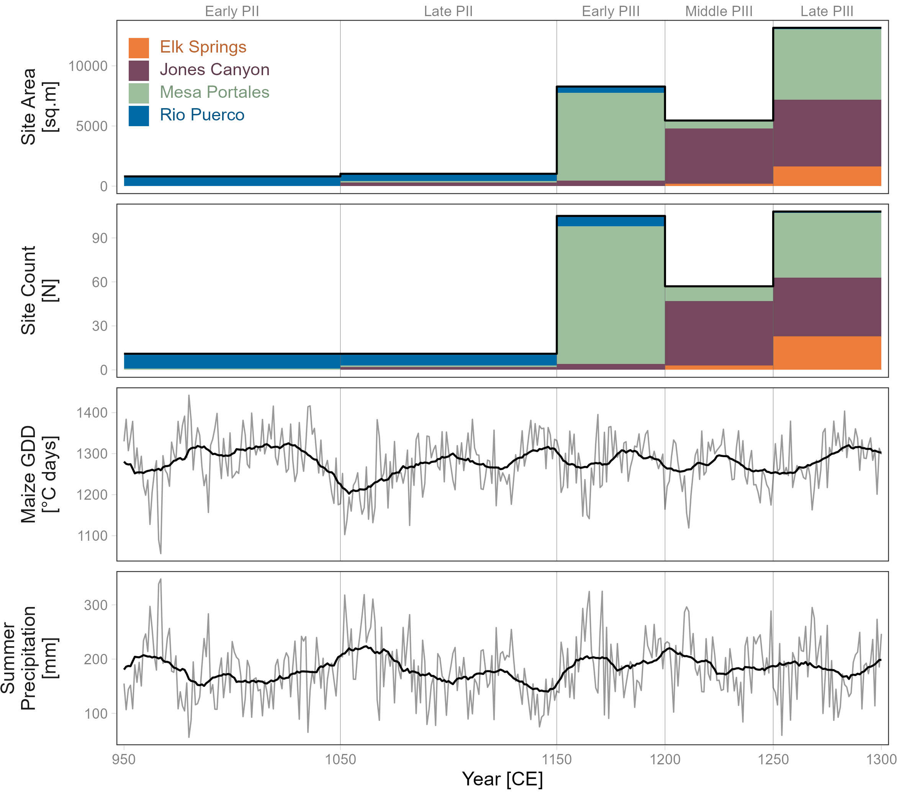{width="90%"
fig-alt="Figure shows time series for climate and population."}

Figure shows time series for climate variables (precipitation and maize GDD) and
two proxies for population size (total combined site area and site count). Note
that the height of the bars in the population panels represent the total
estimate for the project area. The filled and stacked bars are the distributions
across regions for each time period.
:::

#### **Does the relationship between abundance and site size vary through time?**

```{r}

abundance <- left_join(
  abundance,
  phases[c("site_id", "phase")],
  by = "site_id"
)

temporal_abundance_model <- lm(
  log(ratio) ~ log(site_area) + phase,
  data = abundance
)

```

```{r}
#| code-fold: true

temporal_abundance_model |>
  tidy() |>
  mutate(
    term = str_replace(term, pattern = "phase", replacement = "phase: ")
  ) |>
  rename_with(str_replace, pattern = "\\.", replacement = " ") |>
  rename_with(str_to_title) |>
  rename(
    "t Value" = Statistic,
    "p Value" = "P Value"
  ) |>
  mutate(across(2:5, \(x){
    round(x, 4)
  })) |>
  kbl(
    caption = "Coefficient Estimates",
    table.attr = "class='kibble'"
  ) |>
  kable_styling(
    bootstrap_options = "hover",
    full_width = FALSE,
    position = "left"
  )

```

We already have a sense of what the slope looks like, but how does the mean
response vary over time given the average mound area?

```{r}
#| code-fold: true

dependence <- predict_response(
  temporal_abundance_model,
  terms = list(
    "site_area" = mean(abundance[["site_area"]]),
    phase = names(phase_colors)
  ),
  back_transform = FALSE
)

lbls <- tibble(
  group = names(phase_colors),
  y = max(dependence[["conf.high"]]) + 0.1
)

gg <- ggplot(dependence, aes(group, color = group, fill = group)) +
  geom_errorbar(
    aes(ymin = conf.low, ymax = conf.high),
    linewidth = 0.8,
    width = 0.13
  ) +
  geom_point(
    aes(y = predicted),
    shape = 21,
    size = 3.5,
    stroke = 0.6
  ) +
  geom_text(
    data = lbls,
    aes(group, y, label = group, color = group),
    size = 13 / .pt,
    hjust = 0.5,
    vjust = 1
  ) +
  annotate(
    "text",
    x = 5.4,
    y = min(dependence[["conf.low"]]),
    label = paste0(
      "*Assuming average site size: log(",
      round(mean(abundance[["site_area"]]), 2),
      " sq.m)"
    ),
    hjust = 1,
    vjust = 0,
    color = "gray35",
    size = 10 / .pt
  ) +
  scale_color_manual(name = NULL, values = darken(phase_colors, 0.2)) +
  scale_fill_manual(name = NULL, values = lighten(phase_colors, 0.2)) +
  labs(
    x = NULL,
    y = "Natural Log of Ratio of\nDecorated to Undecorated Ceramics"
  ) +
  theme(
    axis.text.x = element_blank(),
    axis.ticks.x = element_blank(),
    axis.title.x = element_blank(),
    legend.position = "none",
    panel.grid.major = element_line(color = "grey92", linewidth = 0.3)
  )

fn <- here("figures", "temporal-abundance-dependence.png")

ggsave(
  plot = gg,
  filename = fn,
  width = 6,
  height = 4.25,
  dpi = 300
)

prepare_image(fn)

remove(dependence, lbls, gg, fn)

```

::: {#fig-temporal-abundance-dependence}
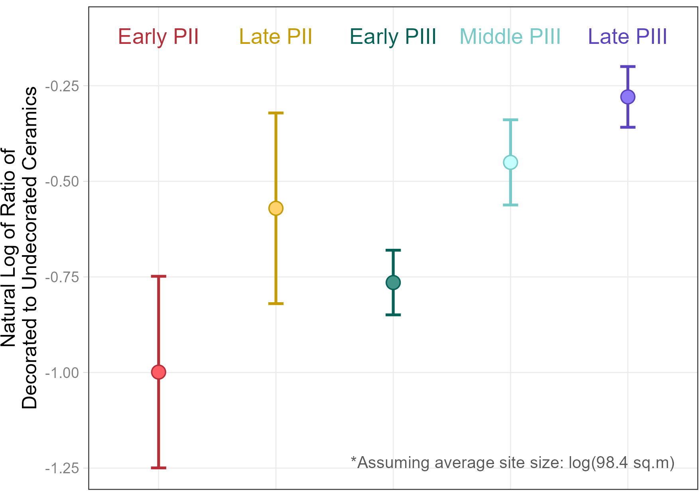{width="60%"
fig-alt="Figure shows response of abundance of decorated ceramics to site size by time period."}

Figure shows response of abundance of decorated ceramics to site size by time
period. Note that the y axis has a log scale.
:::

Here are the linear model diagnostics.

```{r}
#| fig-align: center
#| out-width: 85%

check_model(
  temporal_abundance_model,
  check = c("qq", "linearity", "homogeneity", "outliers"),
  detrend = FALSE
)

```

The non-linearity is almost completely gone in this model, but
heteroskedasticity appears to have increased. Incorporating an intercept offset
for region and time period might address this issue, but that's asking a lot of
a linear model applied to this small dataset.

#### **How are burned sites distributed across the region?**

There is an interesting pattern of burned sites that may have something to do
with the pattern of settlement in the region.

```{r}
#| code-fold: true

bb8 <- survey_area |>
  st_buffer(1000) |>
  st_bbox()

dx <- bb8[["xmax"]] - bb8[["xmin"]]
dy <- bb8[["ymax"]] - bb8[["ymin"]]

cover <- st_sym_difference(survey_area, st_as_sfc(bb8))

lbls <- tibble(
  x = st_bbox(survey_area)[["xmax"]] - 500,
  y = st_bbox(survey_area)[["ymin"]] + seq(2000, 5800, length = 4)[3:4],
  burn = c("Yes", "No"),
  label = c("Burned", "Not Burned")
)

gg <- ggplot() +
  geom_spatraster_contour_filled(
    data = elevation,
    bins = 10,
    color = "gray30",
    linewidth = 0.1
  ) +
  scale_fill_cross_blended_d(
    palette = "arid",
    alpha = 0.7,
    guide = "none"
  ) +
  ggnewscale::new_scale_fill() +
  geom_sf(
    data = survey_area,
    fill = "transparent",
    color = "black"
  ) +
  geom_sf(
    data = cover,
    fill = alpha("white", 0.7),
    color = "transparent"
  ) +
  geom_sf(
    data = rio_puerco |> st_intersection(survey_area),
    color = "#7A96C2",
    linewidth = 0.5
  ) +
  with_outer_glow(
    geom_sf(
      data = sites,
      aes(fill = burn),
      size = 2.75,
      shape = 21,
      color = "black",
      stroke = 0.2
    ),
    colour = "white",
    expand = 3.5,
    sigma = 2
  ) +
  scale_fill_manual(
    name = NULL,
    values = alpha(c("Yes" = "#fd4d00", "No" = "#523800"), 0.9)
  ) +
  geom_sf(
    data = st_as_sfc(bb8),
    fill = "transparent",
    color = "black"
  ) +
  geom_point(
    data = lbls,
    aes(x, y, fill = burn),
    size = 2.75,
    shape = 21,
    color = "black",
    stroke = 0.2
  ) +
  geom_text(
    data = lbls,
    aes(x, y, label = label, color = burn),
    size = 12 / .pt,
    hjust = 1,
    vjust = 0.4,
    nudge_x = -500
  ) +
  scale_color_manual(
    name = NULL,
    values = darken(c("Yes" = "#fd4d00", "No" = "#523800"), 0.2)
  ) +
  annotate(
    "text",
    x = st_bbox(survey_area)[["xmin"]],
    y = st_bbox(survey_area)[["ymax"]],
    label = "Rio Puerco Project",
    size = 14 / .pt,
    hjust = 0,
    vjust = 1,
    fontface = "bold",
    lineheight = 0.85
  ) +
  annotation_scale(
    aes(location = "br"),
    text_cex = 0.9,
    pad_x = unit(0.7, "cm"),
    pad_y = unit(0.65, "cm")
  ) +
  coord_sf(
    crs = 26913,
    datum = 26913,
    expand = FALSE,
    xlim = bb8[c("xmin", "xmax")],
    ylim = bb8[c("ymin", "ymax")]
  ) +
  theme_void() +
  theme(
    legend.position = "none",
    plot.margin = margin(r = 1)
  )

ggsave(
  plot = gg,
  filename = here("figures", "burned-sites-map.png"),
  width = 5,
  height = 5 * (dy / dx),
  dpi = 300,
  bg = "white"
)

remove(bb8, dx, dy, cover, gg, lbls)

```

::: {#fig-burn-map}
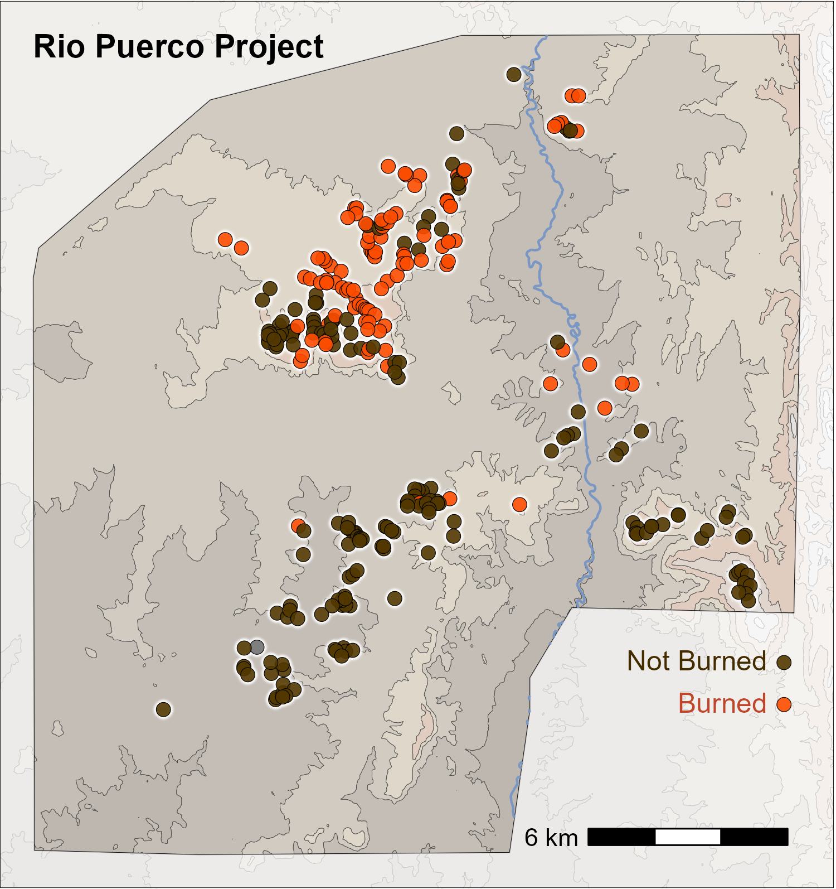{width="60%"
fig-alt="Figure shows geographic distribution of sites with evidence of burning."}

Figure shows geographic distribution of sites with evidence of burning.
:::

#### **How are lithics distributed across survey areas and time periods?**

```{r}

lithic_summary <- site_phases |>
  st_drop_geometry() |>
  left_join(lithics, by = "site_id") |>
  group_by(region, phase, type) |>
  summarize(count = sum(count)) |>
  ungroup() |>
  complete(region, phase, type, fill = list(count = 0))

```

```{r}
#| code-fold: true

tbl <- lithic_summary |>
  mutate(
    phase_id = case_when(
      phase == "Early PII" ~ 1L,
      phase == "Late PII" ~ 2L,
      phase == "Early PIII" ~ 3L,
      phase == "Middle PIII" ~ 4L,
      TRUE ~ 5L
    ),
    region = region_labels[region]
  ) |>
  pivot_wider(
    names_from = region,
    values_from = count,
    values_fill = 0
  ) |>
  arrange(phase_id, type) |>
  select(-phase_id)

idx <- rep(10, 5)
names(idx) <- names(phase_colors)

tbl_lithic_summary <- tbl |>
  select(-phase) |>
  kbl(
    col.names = c("\u200B", unname(region_labels)),
    align = c("lrrrrr"),
    table.attr = "class='kibble'",
    escape = FALSE
  ) |>
  column_spec(2:5, width = "17%") |>
  pack_rows(index = idx)

remove(tbl)

tbl_lithic_summary |>
  kable_styling(bootstrap_options = c("hover", "condensed")) |>
  scroll_box(height = "450px")
```

## Store Tables

Tables are still a mess in Quarto, so we store everything we need to recreate them in the manuscript. To be fair, that's mostly because everyone still wants to support LaTeX, and LaTeX is terrible.

```{r}

save(
  list = ls(pattern = "tbl_"),
  file = here("data", "tables.Rdata")
)

```

## Session Info

```{r}
#| code-fold: true

# save the session info as an object
pkg_sesh <- sessioninfo::session_info(pkgs = "attached")

# inject the quarto info
pkg_sesh$platform$quarto <- paste(
  quarto::quarto_version(),
  "@",
  quarto::quarto_path()
)

# print it out
pkg_sesh

```

```{js, echo = FALSE}

// Get all <h4> elements on the page
const headers = document.querySelectorAll('h4');

// Create an ordered list element to hold the headers
const list = document.createElement('ol');

// Loop through each header and add it to the list
headers.forEach((header, index) => {

    // Create a unique ID for each <h4> header if it doesn't already have one
    if (!header.id) {
        header.id = `header-${index + 1}`;
    }

    // Create a list item
    const listItem = document.createElement('li');
    
    // Create a link
    const link = document.createElement('a');
    
    // Set the href to the header's ID
    link.href = `#${header.id}`; 
    
    // Set the link text to the header's text
    link.textContent = header.textContent; 
    
    // Append the link to the list item, then add the item to the ordered list
    listItem.appendChild(link);
    list.appendChild(listItem);
    
});

// Select the div where you want to place the list
const targetDiv = document.getElementById('question-toc');

// Append the list to the target div
if (targetDiv) {
    targetDiv.appendChild(list);
}

```
