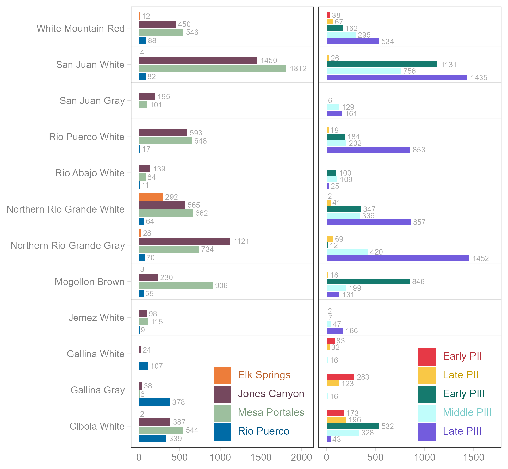
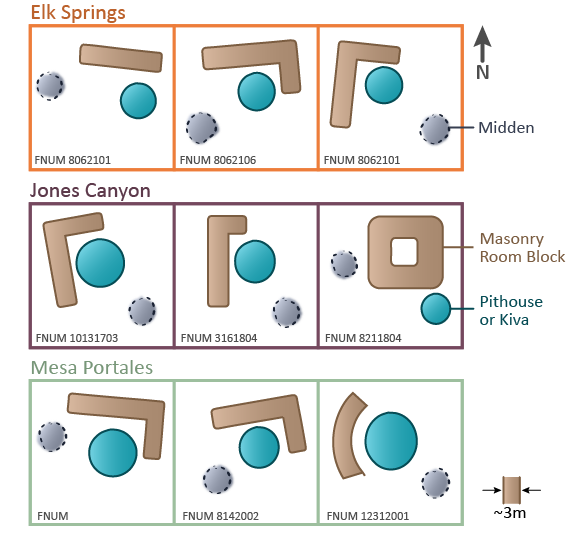

```{r}

library(here)
library(kableExtra)

# the pain of LaTeX PDFs...
here("data", "tables.RData") |> load()

```

## Introduction

Early settlement pattern research in North America tended to focus on core areas
characterized by a relatively high population density and a well-defined
material culture tradition, such as the Mississippi River Valley
[@phillips_etal2003], Chaco Canyon in New Mexico [@hayes_etal1981], or Mesa
Verde in Colorado [@rohn1977; @hayes1964]. However, as survey work has become
increasingly associated with cultural resource management, settlement pattern
data have accumulated from peripheral areas with lower population densities and
“weaker” material culture patterns. We believe it is productive to subdivide
these peripheries into interstitial vs. frontier regions: the former are areas
that lay between multiple core areas, sometimes referred to as joint-use
territories; and the latter are areas at the edge of a core region that were
settled by migration from the adjacent core [@herr2018]. @herr2001 frames the
distinction between cores and peripheries in terms of the relative demand for
land and labor, with core areas having abundant labor and limited land, and
peripheries having abundant land and limited labor. This leads people in
peripheral areas to seek more extensive social connections [@duff2002],
resulting in enhanced cultural diversity and enhanced raw material for social
innovation [@lightfoot1995].

Interpretation of settlement data from interstitial areas follows different
principles than are appropriate for frontiers and core areas. For example, in
core areas, one would expect population growth to reflect prosperity related to
environmental conditions, social development, or both; and in frontiers one
would expect population growth to follow that of the associated core as
population spills out of it. Also, whereas core areas and frontiers are
typically characterized by a well-defined material culture tradition whose
development can be traced over long periods of time; interstitial areas are
typically characterized by mixtures of material cultures associated with
successive waves of migration or influence from different core areas. As a
result, traces of migration are often easier to identify in interstitial areas
than they are in core areas. Finally, whereas core areas are typically settled
by large populations over long periods, during which knowledge of the local
environment accumulates and is maintained by the social network, interstitial
areas are often resettled multiple times by small groups of people who have less
prior knowledge of how to make a living in the local environment. As a result,
the archaeology of interstitial areas provides a record of the process by which
small groups accumulate environmental knowledge, reflected in differing
agricultural strategies associated with each episode of migration.

In this paper we illustrate the potential of interstitial areas for these topics
by analyzing settlement data derived from pedestrian survey of a portion of the
Rio Puerco (of the East) watershed in north-central New Mexico. The Rio Puerco
originates in the Sierra Nacimiento and flows southward for about 370 km to its
confluence with the Rio Grande, about 80 km south of Albuquerque. The study area
encompasses about 480 square kilometers (185 sq.miles) and is located about 5
miles south of present-day Cuba, New Mexico (see @fig-overview). It is also
roughly equidistant from Santa Fe to the east, Albuquerque to the south, and
Chaco Culture National Historical Park to the west. Prominent landforms visible
from within the study area include Cabezon Peak and Mesa Prieta to the south,
the Sierra Nacimiento to the east, and the continental divide to the north. The
study area sits in an interstitial area between several centers of ancestral
Puebloan culture, including the San Juan drainage to the northwest, the Cibola
region to the southwest, the Gallina region to the northeast, and the Northern
Rio Grande region to the southeast. As we will show, groups affiliated with
distinct cultural traditions settled the area at different times and developed
different sets of environmental knowledge, reflected in differing agricultural
strategies associated with each episode of migration.

The study area is also important for regional archaeology because it lies along
a likely migration route taken by northern San Juan populations as they
relocated to the Rio Grande drainage during the late 13th century [@varien2010].
This specific episode led to a shifting of the demographic center of gravity of
Puebloan society from the San Juan to the Rio Grande drainage, where most
Puebloan peoples live today. Indeed, the study area is about 50 km north of the
present-day pueblos of Zia and Jemez, and it seems likely that at least some
residents of these pueblos are descendants of the people who lived in the study
area. Adjacent areas have received some previous attention by archaeologists.
@baker_durand2003 describe settlement patterns of the Guadalupe and Mesa Prieta
areas south of Cabezon Peak; and @pippin1987 reports on excavations at the
southeastern-most Chaco great house at Guadalupe Ruin, also south of Cabezon
Peak. Nevertheless, other than a summary paper by @roney1995, the study area
itself has received only cursory attention prior to this work.

The fieldwork reported here was conducted by Shiffler between June 2018 and
October 2021 at the request of the Bureau of Land Management, which manages the
study area today. Four survey areas were covered, which we will refer to as Mesa
Portales, Jones Canyon, Elk Springs, and the Rio Puerco Floodplain (see
@fig-overview). The BLM requested a resurvey of these areas because previous
researchers have offered differing interpretations of the cultural affiliations
of the sites. For example, @roney1996 considers Mesa Portales and Jones Canyon
to be within the Eastern San Juan Basin, with the Gallina culture area to the
north, while [@borck2017a [Figure 1]; see also @borck2018, Figure 4.1] includes
these areas within an extended region containing Gallina culture sites. The
survey was intended to clarify the cultural affiliations of archaeological sites
in the area. In addition to the Gallina culture, the compiled evidence suggests
affiliations with the San Juan, Cibola, and Northern Rio Grande traditions.
Results also show that the region was settled by successive waves of people
associated with these ancestral Pueblo traditions, and that in at least one case
the immigrants strove to maintain their homeland material culture for
generations after arrival.

::: {#fig-overview fig-align="center"}
{width="100%"}

Overview map showing location of sites and their spatial grouping (left) and
location of survey area in the wider region (right).
:::

## Survey Methods

Between 2018 and 2021, Shiffler completed an exhaustive inventory of all
residential sites in the project area using standard pedestrian survey. The
research area was first accessed by vehicle, then previously recorded sites were
revisited and re-recorded. From these sites, Shiffler conducted extensive
surveys, typically following landforms and excluding steep slopes in excess of
approximately 45 degrees. GPS mapping was conducted for each recorded site using
a Garmin GPSMAP 66, which has a mean spatial error of approximately 8 feet
(roughly 2.4 m). Coordinates were corroborated using a Garmin eTrex. The
coordinate reference for spatial data recorded on this project was NAD83 UTM
Zone 13N (EPSG: 26913). Site boundaries are based on the observed extent of the
artifact scatter, with the total estimated site area measured as the product of
the maximum length along each primary axis, both of which are defined by the
orientation of the site. No attempt was made to systematically inventory
isolated artifacts at non-residential locations.

We infer each residential site’s cultural affiliation based on the dominant
ceramic tradition reflected in its ceramic assemblage, with Shiffler’s in-field
ceramic type classifications based on three sources: Winston Hurst’s system for
Rio Puerco and San Juan wares as reported in [@baker_durand2003], Roy Carlson’s
system for White Mountain Red Wares in [@carlson1970], and H.P. Mera’s system
for Northern Rio Grande wares as reported in [@mera1939]. [Schiffler also
tracked the presence vs. absence of mica in Northern Rio Grande gray wares by
separating smeared-indented corrugated (no mica) from Tesuque Gray
(smeared-indented corrugated with mica).] To learn these systems better,
Shiffler visited sites across New Mexico and Arizona where he could observe
sherds of the relevant traditions in core area sites. [Most sites recorded by
the survey contain mixtures of sherds from distinct ceramic traditions,
indicating that broad and diverse social connections were the norm in this
region. Nevertheless, sherds from a single tradition predominate at most sites,
and we treat this as evidence of the primary cultural affiliation, or ancestral
homeland, of the residents, following] @duff1998. See @tbl-regional_ceramics and
@tbl-period_ceramics for summaries of ceramic types and frequencies across
subregions and time periods in the survey area and @fig-ware-dists for for
summary distributions of wares across regions and time periods. For lithic
identification, categories from [@baker_durand2003; @powers_orcutt1999;
@bice_sundt1972; @bice_sundt1976] were used.

Artifact tallies were obtained by first locating middens, then applying an
arbitrary 2x2 meter square to the area with the largest observed density of
surface material. Complete sampling was then performed within that square. This
was done for each midden on a site to capture peak artifact density. To measure
roomblock area, Shiffler used a combination of simple shapes that captured the
outlines of mound areas with the least distortion. The presence of courtyards
was assumed whenever enclosed intramural spaces surrounded by buildings were
found. Similarly, plazas were inferred on sites with observed areas framed on
two sides by buildings and on the other sides by enclosing walls. Finally, kivas
were identified as circular depressions, some with masonry around the perimeter.

## Results

The Rio Puerco survey formally recorded or re-recorded 294 sites: 26 in Elk
Springs, 91 in Jones Canyon, 150 on Mesa Portales, and 27 within the Rio Puerco
Floodplain. While these sites had similar layouts, patterning is discernible
between the four survey areas. Pottery documented at these sites include 41
separate types grouped into 13 wares. Of those types, 13 are utilitarian gray
wares and 28 are decorated types. In general, Cibola White Wares are common
everywhere except Elk Springs; Gallina Gray and White Wares are overrepresented
in the Rio Puerco Floodplain; Jemez White Wares and Mogollon Brown Wares are
most prevalent on Mesa Portales and in Jones Canyon; Northern Rio Grande Gray
Wares and White Wares are also common on Mesa Portales and in Jones Canyon,
though a substantial amount of the latter ware occurs at Elk Springs, too; Rio
Abajo White Wares are found most often on Mesa Portales; Rio Puerco Gray Wares
occur everywhere, but the largest number were found in the Mesa Portales and
Jones Canyon survey areas; and Rio Puerco White Wares occur most frequently in
the Mesa Portales and Jones Canyon survey areas, as do San Juan Gray Wares and
White Wares, and White Mountain Red Wares.

For the most part the pottery types observed date from the Pueblo II through
Pueblo III periods, roughly 900-1300 CE. The one exception to this is the
presence of Biscuit A sherds in Jones Canyon. The presence of this post-1300
type, combined with the absence of Wiyo Black-on-white, suggests return visits
by people who had relocated to the Pajarito Plateau as opposed to continued
occupation or trade.

```{r}
#| label: tbl-regional_ceramics
#| tbl-cap: "Ceramic Assemblages for Each Survey Area"
#| classes: plain
tbl_region_ceramics
```

```{r}
#| label: tbl-period_ceramics
#| tbl-cap: "Ceramic Assemblages for Each Time Period"
#| classes: plain
tbl_period_ceramics
```

::: {#fig-ware-dists}
{width="90%"
fig-alt="Figure shows spatial and temporal distribution of ceramic wares."}

Figure shows spatial and temporal distribution of ceramic wares.
:::

### Settlement Chronology

To establish a simple relative chronology for the study area, we order sites and
their occupational sequences using seriation. For this we rely on a standard
ordination technique known as correspondence analysis (CA), as it reduces the
highly dimensional ceramic assemblages found at each site to a smaller set of
principal components that we can interpret as axes of time [@lyman_etal1998;
@baxter2003]. The dataset for the correspondence analysis includes 292 of the
294 sites and all 28 decorated ceramic types (two sites did not have any
decorated ceramics). These data are stored in a count matrix with 292 rows and
28 columns. The CA is an operation on this count matrix. The results of the CA
are shown in @fig-seriation.

::: {#fig-seriation fig-align="center"}
{width="4in"}

Results of correspondence analysis with gray points representing principal (row)
coordinates for sites and orange triangles representing principal (column)
coordinates for ceramic types. The type keys are as follows. Black-on-white
types include Chaco (chbw), Red Mesa (rmbw), Gallup (gabw), Gallina (gbw),
Cebolleta (cebbw), Puerco (pbw), Reserve (rbw), Kwahe’e (kbw), McElmo (mcembw),
Casa Salazar (csbw), Socorro (sbw), Tularosa (tbw), Vallecitos (vbw), Santa Fe
(sfbw), Mesa Verde (mvbw), Loma Fria (lfbw), and Jemez (jbw). Black-on-white
with external panel design: Mesa Verde (mvbwep) and Loma Fria (lfbwep).
Undiagnostic White Ware: Cibola (ucww) and San Juan (usjww). Black-on-red or
orange: Puerco (pbr), Wingate (winbr), North Plains (npbr), and Saint Johns
(sjbo). Other: Wingate Polychrome (winp), Biscuit A (bisca), and Saint Johns
(sjp) Polychrome.
:::

After conducting the CA, we then apply k-means clustering to the first two
dimensions of the principal coordinates of the sites (represented by the rows in
the frequency matrix). This is an efficient method that minimizes the variance
within each group, here the variance in the principal coordinates within each
group [@duff1996]. We interpret the resulting clusters in terms of time, so this
application of k-means can loosely be thought of as ensuring that sites within a
group were likely occupied more closely in time relative to the other groups.
Based on our understanding of these ceramic traditions, we choose k = 5 groups
for clustering. We interpret these as Early and Late Pueblo II and Early,
Middle, and Late Pueblo III. The overlay of these interpretations are shown in
the biplots in @fig-clustering.

::: {#fig-clustering fig-align="center"}
{width="4in"}

Results of correspondence analysis with site points color-coded by time period.
Time period assignments are the result of k-means clustering applied to the
results of the correspondence analysis. Point size represents the relative size
of the ceramic assemblage.
:::

Based on the placement of types within the first two axes of the CA output,
Chaco, Red Mesa, Gallup, and Gallina Black-on-white are characteristic of Early
Pueblo II (950-1050 CE). Cebolleta and Puerco Black-on-white and Puerco
Black-on-red indicate a Late Pueblo II (1050-1150 CE) occupation. Reserve,
Kwahe’e, McElmo, and Casa Salazar Black-on-white suggest an Early Pueblo III
(1150-1200 CE) occupation. Middle Pueblo III (1200-1250 CE) is characterized by
non-diagnostic Cibola and San Juan White Ware; Wingate and North Plains
Black-on-red; Socorro, Tularosa, and Vallecitos Black-on-white; and Wingate
Polychrome. A Late Pueblo III (1250-1300 CE) occupation is suggested by Santa
Fe, Mesa Verde, Loma Fria, and Jemez Black-on-white; Mesa Verde and Loma Fria
Black-on-white with external panel designs; Saint Johns Black-on-orange; and
Saint Johns Polychrome. A few Biscuit A sherds were also found on some Middle
and Late Pueblo III sites in Jones Canyon and likely reflect post-occupational
return visits by descendants of residents who had relocated to the Pajarito
Plateau. For additional context, @tbl-regional_ceramics shows the combined
assemblages for ceramic types for each region, and @tbl-period_ceramics shows
the combined ceramic assemblages for each time period.

This chronology suggests that the various survey areas have distinct histories
of settlement (see @fig-seriation-map). Early and Late Pueblo II sites are found
almost entirely along the Rio Puerco Floodplain, with just a small fraction on
Mesa Portales and in Jones Canyon. Early Pueblo III sites are more or less
restricted to the northern portion of Mesa Portales, though a handful can be
found along the Rio Puerco. Some Middle Pueblo III sites are found on Mesa
Portales and at Elk Springs, but the vast majority occur in Jones Canyon.
Finally, Late Pueblo III sites are found on the southern side of Mesa Portales,
in Jones Canyon, and at Elk Springs. We also note that no PII sites occur at Elk
Springs, and only a handful of PIII sites are found in the Rio Puerco
Floodplain.

::: {#fig-seriation-map fig-align="center"}
{width="4in"}

Settlement pattern by time period.
:::

### Cultural Affiliation

It would seem that Pueblo II farmers along the Rio Puerco Floodplain are
associated with both Chaco and Gallina traditions as they include roughly equal
amounts of Gallina gray and white wares and Cibola white wares, including Chaco
and Cebolleta Black-on-white. The Early Pueblo III farmers on the northern slope
of Mesa Portales appear to be a mixed population, with some proportion showing
affiliation with the southern Cibola region, and others showing affiliation with
Mesa Verde. This is evidenced by the fact that most of the Mogollon Brown Ware
is found on these Early Pueblo III sites, suggesting affiliation with the
southern Cibola region [@peeples2018], and two-thirds of all the McElmo
Black-on-white observed in the study area are also found on these sites,
suggesting affiliation with Mesa Verde. Middle Pueblo III sites in Jones Canyon
have extremely diverse assemblages, with ceramic types from virtually every
tradition present, but they appear to be most closely aligned with the northern
Cibola area, particularly given the mixture of Cibola White and White Mountain
Red Wares, with the former declining from Early to Late Pueblo III, the latter
increasing over that period [@peeples2018].

While San Juan, Rio Puerco, and Northern Rio Grande White Wares are also present
on these sites, it is not clear that these represent migrations of people from
those areas. For one thing, this period represents a nadir for San Juan types
during Pueblo III, and while Rio Puerco and Northern Rio Grande White Wares also
occur on these sites, they don’t reach their maximum levels until Late Pueblo
III, and then only in other survey areas.

The Late Pueblo III sites on the southern slope of Mesa Portales, in Jones
Canyon, and at Elk Springs offer a more complicated picture of cultural
affiliations, as these later sites include large quantities of San Juan, Rio
Puerco, Northern Rio Grande, and Jemez White Wares, as well as White Mountain
Red Wares. Nevertheless, in each of these survey areas, we interpret the later
Pueblo III sites as being established, in one way or another, by people
descended from the San Juan Tradition. For Late Pueblo III sites in Jones
Canyon, we infer this affiliation from the presence of Jemez White Wares that
imply some connection to nearby Jemez Pueblo, where people speak a Tanoan
language that likely originated in the San Juan drainage [@ortman2012]. For Late
Pueblo III sites at Elk Springs, the fact that the vast majority of Santa Fe
Black-on-white is found there suggests some affiliation with the Pajarito
Tradition in the Northern Rio Grande, which is also plausibly related to the
migration of Tewa-speaking people from the northern San Juan region into the
Northern Rio Grande since the Pajarito Plateau is viewed as one of the
destinations of migrating 13th century northern San Juan populations[@kemp2017;
@ortman2016]. In addition,@duff1998 [ has argued that trade wares reflect both
homeland and future destination areas of a given population, and by this
principle Late Pueblo III residents of Elk Springs would have moved to the
Northern Rio Grande in the late 1200s. Finally,] Rio Puerco White Wares appear
to be local versions of San Juan tradition types, so sites with large portions
of Rio Puerco White Wares, like Late Pueblo III sites at the south end of Mesa
Portales, likely had some affiliation with the San Juan Tradition as well.

It is also worth emphasizing that San Juan White Wares are very frequent during
Early Pueblo III, decline in frequency in Middle Pueblo III, and increase in
frequency again in Late Pueblo III. They also occur most often on sites on Mesa
Portales and in Jones Canyon. Given the relative dating of those sites, this
would suggest that immigrants from the San Juan drainage moved to the northern
slope of Mesa Portales in Early Pueblo III and to the southern slope of Mesa
Portales and Jones Canyon in Late Pueblo III, with Tewa speakers from Mesa Verde
also arriving in the late 13th century and concentrating around Elk Springs.

```{r}
#| label: tbl-lithic_summary
#| tbl-cap: "Lithic Distributions Across Survey Areas and Time Periods"
#| classes: plain
tbl_lithic_summary
```

Researchers often use site orientation (@tbl-site_characteristics, E) and lithic
assemblages (@tbl-lithic_summary) to associate sites with specific traditions
[@kantner2000]. For instance, @lakatos2007 suggests that [pit structure]
orientation can be used to differentiate sites associated with the San Juan and
Rio Grande traditions in the Northern Rio Grande, with San Juan sites being more
south-facing, and Rio Grande sites more east-facing. While this simple model is
no doubt picking up on an important pattern, our findings present a more
complicated picture, especially in Late Pueblo III, when the majority of sites
appear to be associated with the San Juan tradition, at least according to our
interpretation of the ceramics. During the Late Pueblo III period, sites on Mesa
Portales and at Elk Springs are mostly south-facing, while sites in Jones Canyon
are mostly east-facing. @windes1993 argues that orientation is less about
affiliation and more an indicator of seasonal habitation, seasonal habitations
typically being east-facing and year-round habitations south-facing. Presumably,
site size would be correlated with the length of habitation, meaning
south-facing sites would be larger on average if orientation were related to
seasonality. We do not systematically test this possibility, but a cursory view
of the data does not appear to support it. [It also seems to us that orientation
may reflect different passive solar adaptations, with summer heat encouraging an
orientation away from the afternoon summer sun, and winter cold encouraging an
orientation toward the winter sun during the day. If so, one would expect the
optimal orientation to co-vary with latitude as much as with cultural
tradition.] Additional research should be conducted to properly evaluate these
possibilities.

```{r}
#| label: tbl-site_characteristics
#| tbl-cap: "Site Characteristics by Time Period and Region"
#| classes: plain
tbl_site_characteristics |>
  column_spec(1, width = "19%") |>
  column_spec(2, width = "14%") |>
  column_spec(6, width = "14%") |>
  column_spec(c(3:5, 7), width = "13%")
```

### Population Dynamics

Some tentative estimates of population dynamics across the four survey areas and
five time periods are suggested by the ceramic chronology coupled with site
counts and site sizes. Here site size is measured using the combined mound area
for the roomblocks and the area of any kivas that may also occur at a site. So,
we are referring specifically to the built area of each site. These measures for
each site are then summed for each time period and survey area. These summaries
provide coarse estimates of relative population differences through time and
across the study area.

In general, we see two peaks in site counts in Early Pueblo III and Late Pueblo
III, with over one hundred sites occupied in each period. A notable decline in
the number of occupied sites is also visible during the Middle Pueblo III
period, with approximately fifty sites occupied during this interval. The
population footprint in Early and Late Pueblo II is very small when estimated
using site counts, with only a dozen or so sites dating to each period. These
trends in site counts are also reflected in site sizes. The estimates are much
more coarse-grained, but it should be noted that they are consistent with the
reconstruction proposed by @baker_durand2003 [see Figure 9.3, page 181].

Across the four survey areas, the population reconstruction is more variable. In
Early and Late Pueblo II, the total regional population was limited and
concentrated in the Rio Puerco Floodplain. The regional population expanded
dramatically in Early Pueblo III, but most of that was due to population growth
on Mesa Portales, notably on the northern side of the mesa. In Early Pueblo III,
the total population declined, but again mostly on the northern side of Mesa
Portales. During this period, the population in Jones Canyon increased
substantially, even as it fell across the whole study area. Finally, in Late
Pueblo III, the regional population again experienced a substantial increase,
though this is largely driven by growth on the southern slope of Mesa Portales
and at Elk Springs. It appears that the population of Jones Canyon remained
relatively stable from Middle to Late Pueblo III. We note that in Late Pueblo
III, sites appear to be rather evenly distributed between the three survey
areas: Elk Springs, Jones Canyon, and Mesa Portales. However, the distribution
of site area over these survey locations suggests that sites in Jones Canyon and
on the south side of Mesa Portales were slightly larger than those in Elk
Springs.

::: {#fig-population fig-align="center"}
{width="6.5in"}

Time series by survey area, including two proxies for population size (total
site area and site count) and two climate reconstructions related to maize
productivity (summer precipitation and summer maize growing degree days). Note
that the height of the bars in the population panels represent the total
estimate for the project area. The filled and stacked bars are the distributions
across survey areas for each time period. The light gray lines are the annual
point estimates for each climate variable. The dark black line is a rolling
twenty-five year mean centered on each focal year.
:::

### Climate, Farming, and Fire

@fig-population provides a visual representation of population dynamics in the
study area, along with the local climate history derived from SKOPE
[@bocinsky2023], namely summer precipitation (PPT) and maize growing degree days
(GDD). While we do not conduct rigorous statistical tests to measure the
correlation between these variables, the figure does suggest that population
increased dramatically in Early Pueblo III during a period of decreasing maize
GDD and increasing summer precipitation from approximately 1125 to 1175 CE.
Total population declined during Middle Pueblo III, during a period in which
maize GDD is unimodal, with temperatures increasing up to a maximum around 1225
CE then decreasing afterwards. Over the same period, precipitation was steadily
declining, also reaching a low point around 1225 CE. As population rebounded
during Late Pueblo III, farmers then experienced a drop in precipitation and an
increase in GDD around 1275 CE, with precipitation recovering shortly after, but
GDD remaining relatively high.

Some additional patterning in the proposed chronology and population
reconstruction may be inferred on the basis of variability in the local
environment. In particular, the movement of populations across survey areas is
suggestive of changes in farming adaptations and environmental learning as each
of these areas offers unique constraints and trade-offs for maize farming.

Presumably, the floodplain of the Rio Puerco would have provided an ideal
location for maize farming given access to perennial stream water. In addition,
its proximity to the Sierra Nacimiento would mean its soils could also absorb
runoff from winter snowpack. Sites in the Rio Puerco Floodplain would,
therefore, have benefited from flood water farming. This is consistent with the
climate reconstruction, which shows that the small population of Early and Late
Pueblo II farmers would have experienced relatively warm and dry conditions,
potentially making dry farming a less productive alternative. These populations
were also affiliated with the Chaco tradition in which floodwater farming was
more prevalent along the Chaco River [@benson2006]. At some point, the Rio
Puerco became entrenched below the level of the relic floodplain on which these
Pueblo II sites occur, suggesting that at that time the Rio Puerco Floodplain
was characterized by an aggrading stream.

On Mesa Portales, just west of the Rio Puerco, maize agriculture would most
likely have been limited to direct precipitation or “dry” farming, as that
large, elevated landform lacked access to both seasonal water run-off from the
Sierra Nacimiento and perennial stream water from the Rio Puerco. It is notable
that populations, possibly from the southern Cibola and northern San Juan,
settled on this mesa during a period that initially favored dry farming, and
that individuals from the northern San Juan, at least, would have been familiar
with this style of agriculture [@bocinsky2014; @bocinsky2016].

Sites in Jones Canyon and at Elk Springs probably relied on a mixed strategy,
using the Rio Puerco or other floodplains for floodwater farming and run-off
from the nearby mesa slopes (in the case of Jones Canyon) and the Sierra
Nacimiento (for sites at Elk Springs) for run-off irrigation. In Early Pueblo
III, the farmers in Jones Canyon would have been associated with the northern
Cibola tradition, where conditions necessitated substantial water management
strategies [@kintigh1985; @muenchrath2002].

When coupled with the proposed chronology and demographic reconstruction above,
these spatial patterns suggest a shifting reliance on farming strategies. In
general, what we see are Gallina- and Chaco- affiliated farmers settling along
the Rio Puerco during the Late Pueblo II period and practicing flood water
farming during a period of relatively dry and warm conditions. Early Pueblo III
farmers from the southern Cibola and northern San Juan regions then settled the
northern slopes of Mesa Portales during a period of general cooling with wetter
summers, where they practiced dry farming. As temperatures increased and
precipitation declined during Middle Pueblo III, the population center shifted
to Jones Canyon, where farmers could rely on floodwater farming and run-off
irrigation. Near the end of the sequence, Late Pueblo III farmers spread out
across the region, probably applying a variety of farming strategies. Curiously,
farmers do not appear to have returned to the Rio Puerco Floodplain at any point
after Late Pueblo II. This may be due to drought, fire, and down-cutting of the
Rio Puerco itself, which would have removed the floodplain farming niche from
the study area.

The spread of populations across multiple survey areas in Late Pueblo III also
indicates that these populations were becoming more adept at farming regardless
of the particular type of farming as they learned to cope with the unique
challenges posed by these different environments. This is especially evident
given the fact that there was not just an increase in the number and total area
of sites from Early to Late Pueblo III (see @tbl-site_characteristics, A and B),
but total site sizes were also increasing over this period (see
@tbl-site_characteristics, C). As populations continued to infill the study
area, individual settlements continued to grow as their residents adapted to
local environments, becoming more efficient and able to support more complex
settlements.

Another pattern worth mentioning here involves the spatial distribution of
burned sites. Nearly all of these are found on Mesa Portales and are associated
with Early Pueblo III occupations (see @fig-burning and
@tbl-site_characteristics, D). The fact that these sites are in close proximity
to unburned sites associated with Middle and Late Pueblo III occupations
suggests that a large regional fire event occurred at the end of Early Pueblo
III. Future excavation of some of these burned sites could determine whether a
catastrophic wildfire was the cause of abandonment, or whether it occurred after
residents had moved away. It is worth noting that the period of the fire appears
to be associated with a substantial reshuffling of the population across survey
areas, with most farmers, as noted already, moving into Jones Canyon during
Middle Pueblo III.

::: {#fig-burning fig-align="center"}
{width="4in"}

Geographic distribution of sites with evidence of burning.
:::

### Agglomeration Effects

As mentioned above, there is some indication of limited agglomeration into
larger, more centralized settlements. For instance, survey data suggests that
the south end of Mesa Portales likely consisted of two communities of about
150-300 people, with one on the east half, the other on the west half, of the
landform. Each has a clear central site with architectural features relating to
the landscape. In the east community, an E-shaped building with two kivas faces
east, aligning with two kivas further to the east. This site has some Northern
Rio Grande tradition pottery mixed with Loma Fria Black-on-white and Mesa Verde
wares. In the west community, a large site with three kivas but few Northern Rio
Grande ceramics faces south.

::: {#fig-scaling fig-align="center"}
{width="4.5in"}

Response of decorated ceramics to site size. Note that the x and y axes both
have log scales. Points are colored according to the survey area in which they
are located.
:::

The emergence of central places and settlement clustering may be due to network
effects that incentivize individual movement to more agglomerated settlements
[@ortman2015]. To test for the presence of such scaling effects, we apply a
method proposed by [@ortman2020] that measures the relationship between painted
pottery and built area at each site. Specifically, we calculate the ratio of
painted to unpainted ceramics, under the assumption that increases in this ratio
reflects the relative frequency of socializing with food relative to food
preparation. [In this case, the built area for each site serves as a proxy for
total population. As these quantities are proxies for a socioeconomic rate and a
population size, settlement scaling theory suggests the ratio of decorated to
undecorated wares should increase with built area. This can be tested using a
simple log-log linear model fit with ordinary least squares (see @fig-scaling).
Model results suggest that the relationship between these proxies for per capita
socioeconomic productivity and population size is, in fact, positive and
significant (β = 0.337, p \< 0.0001).] For more details about model parameters,
see @tbl-scaling_regression.

```{r}
#| label: tbl-scaling_regression
#| tbl-cap: "Coefficient Estimates"
#| classes: plain
tbl_regression
```

## Discussion

@borck2017b [have included the study area within an extended Gallina culture
area, but it is clear from our results that population dynamics were more
variable than this association would suggest.] While these authors recognize
that migrants to these areas came from many different places, Gallina ceramics
are mostly restricted to Pueblo II sites along the Rio Puerco. In fact, our
evidence suggests that populations were migrating into and out of different
parts of the study area at different times throughout the Ancestral Pueblo
sequence, at least up to the Great Drought at the end of Late Pueblo III. It is
likely that residents were even migrating into and out of these areas several
centuries before the Gallina tradition first appears to the north, around 1100
CE.

::: {#fig-layouts fig-align="center"}
{width="5in"}

Representative site layouts for the different survey areas.
:::

Other important lines of evidence include architectural and settlement patterns.
Gallina specialists [@borck2017a; @borck2017b] argue that residential pit
structures are a key feature of Gallina material culture that persisted up to
regional abandonment. At the sites recorded by Shiffler, however, there is no
evidence of residential pit structures. Instead, the architectural pattern is
more in keeping with wider Ancestral Puebloan developments, including above
ground room blocks, small kivas, and plazas (see @fig-layouts). While farmsteads
in this study area are generally dispersed, similar to the Gallina settlement
pattern [@borck2017a], this would not have been uncommon among non-Gallina
Ancestral Puebloans during the periods in question, even at the height of the
Chacoan system. Furthermore, as mentioned previously, there is some indication
of at least limited agglomeration into larger settlements. And the positive,
non-linear relationship between population and productivity observed elsewhere
in the Southwest is replicated with this dataset [@ortman2020].

Researchers have interpreted the presence of burned sites as evidence of warfare
precipitated either by Gallina-affiliated peoples or by desperate migrants from
the northern San Juan who were displaced by drought [@dick1976; @ellis1976]. In
most cases, however, the burned sites of the Gallina region also had direct
evidence of violence, usually in the form of skeletal trauma. Data from this
survey cannot speak to this question one way or the other, but it is worth
noting that burned sites on Mesa Portales appear to be associated with Late
Pueblo II farmers that occupied the area well before the disturbances of the
late thirteenth century. In sum, the current evidence from Mesa Portales is most
consistent with wildfires associated with a period of drought as the explanation
for the burned sites.

## Conclusion

The Rio Puerco study area offers important lines of evidence for this
interstitial area of the Ancestral Pueblo World. Our exploratory analyses are
suggestive of interesting migration patterns that speak to larger debates in the
region, with Chaco migrants settling along the Rio Puerco during Pueblo II,
southern Cibola migrants settling the northern part of Mesa Portales in Early
Pueblo III, northern Cibola migrants settling Jones Canyon in Middle Pueblo III,
and San Juan migrants, largely from the Mesa Verde region, settling Mesa
Portales, Jones Canyon, and Elk Springs during Early and Late Pueblo III. The
different environments of these survey areas also likely promoted different
farming adaptations including flood water farming along the Rio Puerco
Floodplain, dry farming on Mesa Portales, and runoff farming in Jones Canyon and
at Elk Springs. When these different areas were occupied and what strategies
were used at each appears to have been driven by climate fluctuations, notably
long term changes in maize GDD and summer precipitation, though these
relationships require further scrutiny. What is more, environmental learning
likely led to increasing agglomeration and social complexity, as evidenced by
the spread of populations across the diverse environments of Mesa Portales,
Jones Canyon, and Elk Springs during late Pueblo III, and the increase in site
size over the same period. Additional work needs to be done to more precisely
date sites in the study area and to estimate changes in population through time.
Larger regional comparisons would also help illuminate the core-periphery
patterns of the Rio Puerco within the wider Ancestral Puebloan region.

## Author Statements

### Funding

Portions of this research were supported by a grant from the National Science
Foundation (#2213921, to Ortman) and the United States Air Force Research Lab.

### Author Contributions

Vernon conducted all analyses and wrote the manuscript. Ortman contributed to
writing and analysis. Shiffler collected data and contributed to writing and
analysis.

### Conflicts of Interest

The authors declare no conflicts of interest.

### Data Availability

Spatial locations of archaeological sites are protected data and cannot be
shared publicly. However, the authors include all attribute data associated with
this analysis (ceramic and lithic counts, site area, etc.) in a spreadsheet in
the associated GitHub repository: <https://github.com/kbvernon/rio-puerco>.

## References

::: {#refs}
:::